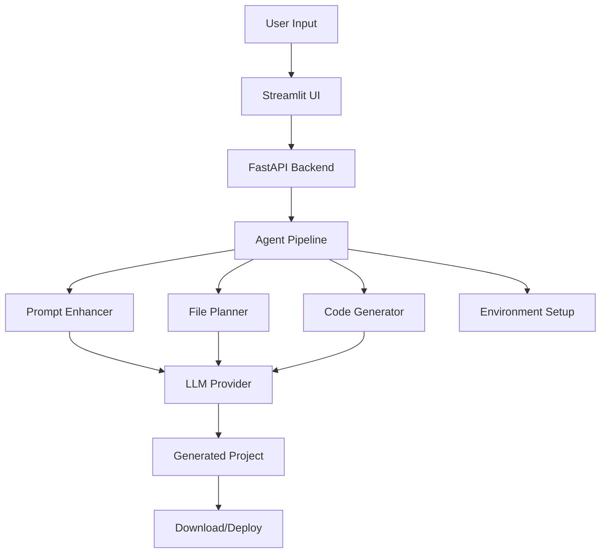
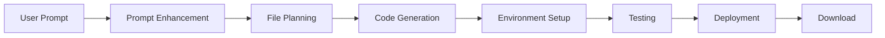

# Agent Control Hub

[](https://github.com/Dzg0507/AgentHub/actions/workflows/ci.yml)
[](https://www.python.org/downloads/)
[](https://opensource.org/licenses/MIT)
[](https://github.com/psf/black)
[](https://streamlit.io/)

A centralized hub for multi-agent code creation, enhancement, and deployment using Streamlit UI and FastAPI backend. Build complete applications with AI-powered agents that handle everything from prompt enhancement to deployment.

## 🚀 Features

- **🤖 Multi-Agent Code Generation**: Collaborative AI agents for prompt enhancement, file planning, code generation, testing, and deployment
- **🌐 Language Support**: Python, Node.js, React+TypeScript, Three.js, Go, Rust, Java
- **🔧 Virtual Environment Management**: Per-project virtual environments with setup automation
- **💻 Modern UI**: Streamlit-based web interface with real-time project management
- **⚡ FastAPI Backend**: RESTful API with automatic documentation
- **📁 File Generation**: Guaranteed file creation with fallback scaffolding
- **🔄 Real-time Monitoring**: Live project status and progress tracking
- **📦 One-Click Deployment**: Complete project packaging and download

## 🏗️ Architecture



## 📁 Project Structure

```
Agent_Control_Hub/
├── src/                    # Main source code
│   ├── llm/               # LLM provider abstraction
│   ├── ui/                # User interface components
│   └── main.py            # Main entry point
├── agents/                # Agent definitions and factory
├── services/              # Business logic services
├── core/                  # Core configuration
├── models/                # Pydantic response models
├── routers/               # FastAPI routers
├── server/                # FastAPI application
├── utils/                 # Utility functions
├── tests/                 # Test files
├── examples/              # Example files
├── config/                # Configuration files
├── docs/                  # Documentation
├── prompts/               # Externalized prompts
├── templates/             # HTML templates
├── workspace/             # Agent workspace
└── logs/                  # Log files
```

## 🚀 Quick Start

### Prerequisites

- Python 3.8 or higher
- Git

> 📖 **New to Agent Control Hub?** Check out our [Complete Setup Guide](SETUP_GUIDE.md) for detailed step-by-step instructions with screenshots!

### Installation

1. **Clone the repository**:
   ```bash
   git clone https://github.com/Dzg0507/AgentHub.git
   cd AgentHub
   ```

2. **Create a virtual environment**:
   ```bash
   python -m venv .venv
   source .venv/bin/activate  # On Windows: .venv\Scripts\activate
   ```

3. **Install dependencies**:
   ```bash
   pip install -r requirements.txt
   ```

4. **Set up environment variables**:
   ```bash
   # Copy the example environment file
   cp config/env.example .env
   
   # Edit .env with your API keys
   nano .env  # or use your preferred editor
   ```

   Example `.env` file:
   ```env
   # LLM Provider Configuration
   LLM_PROVIDER=gemini
   GOOGLE_API_KEY=your_google_api_key_here
   TOGETHER_API_KEY=your_together_api_key_here
   OPENROUTER_API_KEY=your_openrouter_api_key_here
   LLM_MODEL=gemini-1.5-flash
   ```

### 🎯 One-Command Startup (Recommended)

**Start everything with one command:**

```bash
# Quick launcher (recommended)
python run.py both

# Or use the full script
python scripts/start_hub.py
```

Or use the platform-specific scripts:
- **Windows**: Double-click `scripts/start_hub.bat` or run `scripts/start_hub.bat`
- **Unix/Linux/Mac**: `./scripts/start_hub.sh`

This will automatically:
- ✅ Start the FastAPI server on http://127.0.0.1:8000
- ✅ Start the Streamlit UI on http://localhost:8501
- ✅ Monitor both processes and restart if needed
- ✅ Provide unified shutdown with Ctrl+C

## 🎨 UI Features

> 📸 **Want to see what it looks like?** Check out our [Visual Guide](VISUAL_GUIDE.md) with detailed screenshots of every feature!

### 🏠 Dashboard
- Welcome page with project creation
- Recent projects overview
- Quick start templates

### 📋 Project Management
- Comprehensive project listing
- Filtering and sorting capabilities
- Real-time status updates
- Project download and management

### 🏥 Server Status
- Real-time server health monitoring
- Server management controls
- Process monitoring and restart

### 🛠️ Debug Tools
- Testing and debugging utilities
- Log viewing and analysis
- Error tracking and resolution

### 🚀 Pipeline Visualization
- Step-by-step process tracking
- Progress indicators
- Real-time status updates

## 🔌 API Endpoints

### Projects
- `POST /projects` - Create a new project
- `GET /projects` - List all projects
- `GET /projects/{id}` - Get project details
- `DELETE /projects/{id}` - Delete a project
- `GET /projects/{id}/download` - Download project as ZIP
- `GET /projects/{id}/files` - List project files
- `GET /projects/{id}/logs` - Get execution logs
- `POST /projects/{id}/retry` - Retry project processing
- `POST /projects/{id}/force-scaffold` - Force create minimal scaffold
- `POST /projects/{id}/venv` - Create virtual environment
- `POST /projects/{id}/setup` - Run setup commands

### System
- `GET /` - Root endpoint with server info
- `GET /health` - Health check
- `GET /ui` - Built-in web interface
- `GET /docs` - Interactive API documentation

## 🌐 Supported Languages

| Language | Framework | Package Manager | Status |
|----------|-----------|-----------------|--------|
| Python | Standard Library | pip | ✅ Full Support |
| Node.js | Express/Fastify | npm | ✅ Full Support |
| React | TypeScript | npm/yarn | ✅ Full Support |
| Three.js | WebGL | npm | ✅ Full Support |
| Go | Standard Library | go mod | ✅ Full Support |
| Rust | Cargo | cargo | ✅ Full Support |
| Java | Spring Boot | Gradle | ✅ Full Support |

## 🔄 Project Workflow



1. **📝 Create Project**: Submit a prompt describing what you want to build
2. **✨ Prompt Enhancement**: AI enhances your prompt with technical requirements
3. **📋 File Planning**: AI creates a structured file plan for the project
4. **💻 Code Generation**: AI generates complete, runnable code
5. **🔧 Environment Setup**: Virtual environment and dependencies are configured
6. **🧪 Testing**: Generated code is tested for functionality
7. **🚀 Deployment**: Project is packaged and ready for deployment
8. **📦 Download**: Get your complete project as a ZIP file

## ⚙️ Configuration

### Environment Variables

| Variable | Description | Default | Required |
|----------|-------------|---------|----------|
| `LLM_PROVIDER` | LLM provider to use | `gemini` | Yes |
| `GOOGLE_API_KEY` | Google API key for Gemini | - | If using Gemini |
| `TOGETHER_API_KEY` | Together.ai API key | - | If using Together |
| `OPENROUTER_API_KEY` | OpenRouter API key | - | If using OpenRouter |
| `LLM_MODEL` | Model to use | `gemini-1.5-flash` | No |
| `LLM_API_BASE` | Custom API base URL | - | No |

### Server Configuration

Key configuration options in `core/config.py`:

- `SERVER_HOST` and `SERVER_PORT`: Server binding address
- `WORKSPACE_DIR`: Directory for generated projects
- `TEMP_TTL_MINUTES`: Project retention time
- `LLM_CONFIG`: Language model configuration
- `SUPPORTED_LANGUAGES`: Available programming languages

## 🧪 Development

### Running Tests

```bash
# Run all tests
python -m pytest tests/ -v

# Run specific test categories
python -m pytest tests/test_basic.py -v
python -m pytest tests/test_llm_provider.py -v
python -m pytest tests/test_utils.py -v

# Run with coverage
python -m pytest tests/ --cov=src --cov-report=html
```

### Code Quality

```bash
# Format code
black .

# Lint code
flake8 .

# Type checking
mypy src/
```

### Adding New Languages

1. Add language to `SUPPORTED_LANGUAGES` in `core/config.py`
2. Update `_write_language_scaffold()` in `services/pipeline.py`
3. Add setup commands in `setup_project()` function
4. Update language selector in `streamlit_app.py`

### Adding New Agents

1. Define agent in `agents/factory.py`
2. Add agent to the returned dictionary
3. Use agent in pipeline functions in `services/pipeline.py`

## 🐛 Troubleshooting

### Common Issues

1. **Import Errors**: Ensure all dependencies are installed and virtual environment is activated
2. **API Key Issues**: Verify API keys are set in `.env` file
3. **Port Conflicts**: Change `SERVER_PORT` in `core/config.py` if port 8000 is in use
4. **File Generation Failures**: Use the "Force Scaffold" button to create minimal files
5. **Memory Issues**: Reduce `TEMP_TTL_MINUTES` to clean up old projects

### Logs

- **Server logs**: `logs/agent_hub.log`
- **Project execution logs**: Available via `/projects/{id}/logs` endpoint
- **Streamlit logs**: Check terminal output
- **CI/CD logs**: Available in GitHub Actions tab

### Getting Help

- 📖 Check the [documentation](docs/)
- 🐛 Report issues on [GitHub Issues](https://github.com/Dzg0507/AgentHub/issues)
- 💬 Start a discussion in [GitHub Discussions](https://github.com/Dzg0507/AgentHub/discussions)

## 🤝 Contributing

We welcome contributions! Please see our [Contributing Guide](CONTRIBUTING.md) for details.

### Quick Contribution Steps

1. Fork the repository
2. Create a feature branch (`git checkout -b feature/amazing-feature`)
3. Make your changes
4. Add tests if applicable
5. Commit your changes (`git commit -m 'Add amazing feature'`)
6. Push to the branch (`git push origin feature/amazing-feature`)
7. Open a Pull Request

### Development Setup

```bash
# Install development dependencies
pip install -e ".[dev]"

# Run pre-commit hooks
pre-commit install

# Run tests
pytest

# Format code
black .
```

## 📄 License

This project is licensed under the MIT License - see the [LICENSE](LICENSE) file for details.

## 🙏 Acknowledgments

- [Streamlit](https://streamlit.io/) for the amazing UI framework
- [FastAPI](https://fastapi.tiangolo.com/) for the high-performance API framework
- [Google Gemini](https://ai.google.dev/) for the AI capabilities
- [Together.ai](https://together.ai/) for additional AI model access
- [OpenRouter](https://openrouter.ai/) for model aggregation

## 📊 Project Status

- ✅ **Core Features**: Complete
- ✅ **Multi-Language Support**: Complete
- ✅ **UI/UX**: Complete
- ✅ **API**: Complete
- ✅ **Testing**: Complete
- ✅ **CI/CD**: Complete
- 🔄 **Documentation**: Ongoing
- 🔄 **Performance Optimization**: Ongoing

## 🚀 Roadmap

- [ ] **Plugin System**: Extensible agent architecture
- [ ] **Database Integration**: Persistent project storage
- [ ] **User Authentication**: Multi-user support
- [ ] **Cloud Deployment**: One-click cloud deployment
- [ ] **Advanced Analytics**: Project metrics and insights
- [ ] **Team Collaboration**: Real-time collaborative editing

---

<div align="center">

**Made with ❤️ by the Agent Control Hub Team**

[⭐ Star this repo](https://github.com/Dzg0507/AgentHub) • [🐛 Report Bug](https://github.com/Dzg0507/AgentHub/issues) • [💡 Request Feature](https://github.com/Dzg0507/AgentHub/issues)

</div># Test trigger

