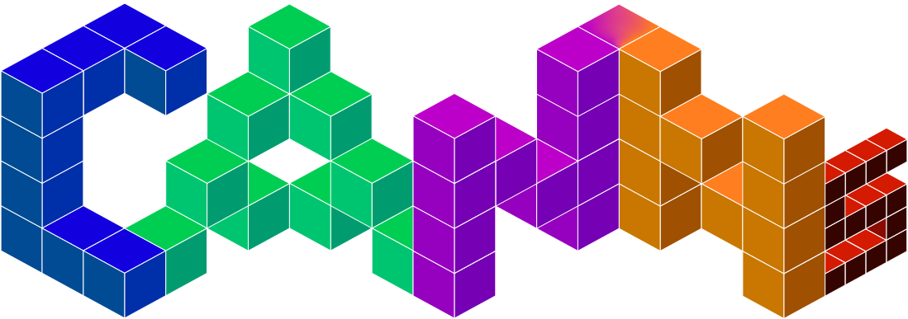

[![Contributors][contributors-shield]][contributors-url]
[![Forks][forks-shield]][forks-url]
[![Stargazers][stars-shield]][stars-url]
[![Issues][issues-shield]][issues-url]
[![project_license][license-shield]][license-url]

<!-- Language Switch -->
**Language**: **English** | [中文](README_zh.md)

<!-- PROJECT LOGO -->
<br />

<div align="center">
  <a href="https://github.com/routhleck/canns">
    
  </a>

<h3 align="center">Continuous Attractor Neural Networks (CANNs) Python Library</h3>

  <p align="center">
    A Python Library for Continuous Attractor Neural Networks (CANNs) and other brain-inspired computational models. It provides a unified, high-level API to easily load, analyze, and train state-of-the-art CANN architectures, enabling researchers and developers to quickly experiment with and deploy brain-inspired solutions.
    <br />
    <a href="https://routhleck.com/canns/"><strong>📖 Documentation »</strong></a>
    <br />
    <br />
    <a href="#getting-started">🚀 Getting Started</a>
    &middot;
    <a href="#examples">💡 Examples</a>
    &middot;
    <a href="https://github.com/routhleck/canns/issues/new?labels=bug&template=bug-report---.md">🐛 Report Bug</a>
    &middot;
    <a href="https://github.com/routhleck/canns/issues/new?labels=enhancement&template=feature-request---.md">✨ Request Feature</a>
  </p>
</div>

---

> ⚠️ **Development Status**: This project is under active development. Features and APIs may be refined and adjusted in future updates.

## 📋 Table of Contents

- [About the Project](#about-the-project)
- [Key Features](#key-features)
- [Getting Started](#getting-started)
- [Installation](#installation)
- [Usage Examples](#usage-examples)
- [Interactive Documentation](#interactive-documentation)
- [Project Structure](#project-structure)
- [Contributing](#contributing)
- [License](#license)
- [Contact](#contact)

## 🎯 About the Project

CANNs (Continuous Attractor Neural Networks) is a Python library specifically designed for continuous attractor neural network research. Built on modern scientific computing frameworks, it provides powerful and user-friendly tools for neuroscience research, computational modeling, and brain-inspired algorithm development.

### 🔬 What are Continuous Attractor Neural Networks?

Continuous Attractor Neural Networks are a special class of neural network models that can maintain stable activity patterns in continuous state spaces. These networks excel in:

- **Spatial Representation**: Encoding continuous spatial positions through population neural activity
- **Working Memory**: Maintaining and updating dynamic information
- **Path Integration**: Computing position changes based on movement information  
- **Smooth Tracking**: Following continuously changing targets

## ✨ Key Features

### 🏗️ Rich Model Library
- **CANN1D/2D**: One and two-dimensional continuous attractor networks
- **SFA Models**: Advanced models with Slow Feature Analysis integration
- **Hierarchical Networks**: Complex architectures supporting multi-level information processing

### 🎮 Task-Oriented Design
- **Path Integration**: Spatial navigation and position estimation tasks
- **Target Tracking**: Smooth continuous tracking of dynamic targets
- **Extensible Framework**: Easy addition of custom task types

### 📊 Powerful Analysis Tools
- **Real-time Visualization**: Energy landscapes, neural activity animations
- **Statistical Analysis**: Firing rates, tuning curves, population dynamics
- **Data Processing**: z-score normalization, time series analysis

### ⚡ High Performance Computing
- **JAX Acceleration**: Efficient numerical computation based on JAX
- **GPU Support**: CUDA and TPU hardware acceleration
- **Parallel Processing**: Optimized for large-scale network simulations

## 🚀 Getting Started

### Installation

```bash
# Basic installation (CPU)
pip install canns

# GPU support (Linux)
pip install canns[cuda12]

# TPU support (Linux)
pip install canns[tpu]
```

### Basic Example

```python
import brainstate
from canns.models.basic import CANN1D
from canns.task.tracking import SmoothTracking1D
from canns.analyzer.visualize import energy_landscape_1d_animation

# Set computation environment
brainstate.environ.set(dt=0.1)

# Create 1D CANN network
cann = CANN1D(num=512)
cann.init_state()

# Define smooth tracking task
task = SmoothTracking1D(
    cann_instance=cann,
    Iext=(1., 0.75, 2., 1.75, 3.),  # External input sequence
    duration=(10., 10., 10., 10.),   # Duration of each phase
    time_step=brainstate.environ.get_dt(),
)

# Get task data
task.get_data()

# Define simulation step
def run_step(t, inputs):
    cann(inputs)
    return cann.u.value, cann.inp.value

# Run simulation
us, inps = brainstate.compile.for_loop(
    run_step,
    task.run_steps,
    task.data,
    pbar=brainstate.compile.ProgressBar(10)
)

# Generate energy landscape animation
energy_landscape_1d_animation(
    {'u': (cann.x, us), 'Iext': (cann.x, inps)},
    time_steps_per_second=100,
    fps=20,
    title='Smooth Tracking Task',
    save_path='tracking_demo.gif'
)
```

## 📖 Interactive Documentation

We provide comprehensive interactive documentation where you can run code examples directly in your browser:

### 🌐 Run Online
- [](https://mybinder.org/v2/gh/routhleck/canns/HEAD?filepath=docs%2Fen%2Fnotebooks) **MyBinder** - Free online Jupyter environment
- [](https://colab.research.google.com/github/routhleck/canns/blob/master/docs/en/notebooks/) **Google Colab** - Requires Google account

### 📚 Documentation Structure
- **[Introduction](docs/en/notebooks/01_introduction.ipynb)** - Basic concepts and introduction to CANNs
- **[Quick Start](docs/en/notebooks/02_quickstart.ipynb)** - Common use cases and getting started quickly
- **[Core Concepts](docs/en/notebooks/03_core_concepts.ipynb)** - Mathematical principles and theoretical foundations

## 📁 Project Structure

```
canns/
├── src/canns/
│   ├── models/          # Neural network models
│   │   ├── basic/       # Basic CANN models
│   │   ├── brain_inspired/  # Brain-inspired models
│   │   └── hybrid/      # Hybrid models
│   ├── task/            # Task definitions
│   │   ├── tracking.py      # Tracking tasks
│   │   └── path_integration.py  # Path integration
│   ├── analyzer/        # Analysis tools
│   │   ├── utils.py         # Analysis utility functions
│   │   └── visualize.py     # Visualization tools
│   ├── trainer/         # Training framework
│   └── pipeline/        # Data pipeline
├── examples/            # Usage examples
├── docs/               # Documentation
│   ├── en/             # English documentation
│   └── zh/             # Chinese documentation
├── tests/              # Unit tests
└── binder/             # Binder configuration
```

## 💡 Usage Examples

### 1D Oscillatory Tracking

```python
import brainstate
from canns.analyzer.visualize import energy_landscape_1d_animation
from canns.models.basic import CANN1D
from canns.task.tracking import SmoothTracking1D

# Set up environment
brainstate.environ.set(dt=0.1)
cann = CANN1D(num=512)
cann.init_state()

# Create tracking task
task_st = SmoothTracking1D(
    cann_instance=cann,
    Iext=(1., 0.75, 2., 1.75, 3.),
    duration=(10., 10., 10., 10.),
    time_step=brainstate.environ.get_dt(),
)
task_st.get_data()

# Run simulation
def run_step(t, inputs):
    cann(inputs)
    return cann.u.value, cann.inp.value

us, inps = brainstate.compile.for_loop(
    run_step, task_st.run_steps, task_st.data,
    pbar=brainstate.compile.ProgressBar(10)
)

# Generate animation
energy_landscape_1d_animation(
    {'u': (cann.x, us), 'Iext': (cann.x, inps)},
    title='1D CANN Oscillatory Tracking',
    save_path='oscillatory_tracking.gif'
)
```

### 2D Spatial Tracking

```python
import brainstate as bst
from canns.analyzer.visualize import energy_landscape_2d_animation
from canns.models.basic import CANN2D
from canns.task.tracking import SmoothTracking2D

bst.environ.set(dt=0.1)
cann = CANN2D(length=100)
cann.init_state()

# 2D tracking with multiple waypoints
task_st = SmoothTracking2D(
    cann_instance=cann,
    Iext=([0., 0.], [1., 1.], [0.75, 0.75], [2., 2.], [1.75, 1.75], [3., 3.]),
    duration=(10., 10., 10., 10., 10.),
    time_step=brainstate.environ.get_dt(),
)
task_st.get_data()

def run_step(t, Iext):
    with bst.environ.context(t=t):
        cann(Iext)
        return cann.u.value, cann.r.value, cann.inp.value

cann_us, cann_rs, inps = bst.compile.for_loop(
    run_step, task_st.run_steps, task_st.data,
    pbar=brainstate.compile.ProgressBar(10)
)

# Create 2D animation
energy_landscape_2d_animation(
    zs_data=cann_us,
    title='2D CANN Spatial Tracking',
    save_path='2d_tracking.gif'
)
```

### Tuning Curve Analysis

```python
import numpy as np
from canns.analyzer.visualize import tuning_curve
from canns.models.basic import CANN1D

# Create circular CANN for orientation
cann = CANN1D(num=512, z_min=-np.pi, z_max=np.pi)
cann.init_state()

# Run tuning curve experiment
task_st = SmoothTracking1D(
    cann_instance=cann,
    Iext=(0., 0., np.pi, 2*np.pi),
    duration=(2., 20., 20.),
    time_step=brainstate.environ.get_dt(),
)
task_st.get_data()

# Analyze tuning properties
neuron_indices_to_plot = [128, 256, 384]
tuning_curve(
    stimulus=task_st.Iext_sequence.squeeze(),
    firing_rates=rs,
    neuron_indices=neuron_indices_to_plot,
    pref_stim=cann.x,
    title='Neural Tuning Curves',
    xlabel='Stimulus Position (rad)',
    ylabel='Firing Rate'
)
```

### Hierarchical Path Integration

```python
import brainstate
from canns.models.basic import HierarchicalNetwork
from canns.task.spatial_navigation import SpatialNavigationTask

# Create path integration task
brainstate.environ.set(dt=0.1)
task_pi = SpatialNavigationTask(
    width=5, height=5,
    speed_mean=0.16, speed_std=0.016,
    duration=1000.0, dt=0.1,
    start_pos=(2.5, 2.5)
)
task_pi.get_data()

# Create hierarchical network
hierarchical_net = HierarchicalNetwork(num_module=5, num_place=30)
hierarchical_net.init_state()


# Run path integration
def run_step(t, vel, loc):
    hierarchical_net(velocity=vel, loc=loc, loc_input_stre=0.)
    return (hierarchical_net.band_x_fr.value,
            hierarchical_net.band_y_fr.value,
            hierarchical_net.grid_fr.value,
            hierarchical_net.place_fr.value)


results = brainstate.compile.for_loop(
    run_step,
    task_pi.data.velocity,
    task_pi.data.position,
    pbar=brainstate.compile.ProgressBar(10)
)
```

## 🛠️ Development Environment

### Dependencies

- **Python**: >= 3.11
- **BrainX**: Core computation framework
- **JAX**: High-performance numerical computing
- **ratinabox**: Spatial cognition modeling
- **matplotlib**: Data visualization
- **tqdm**: Progress display

### Development Tools

- **pytest**: Unit testing
- **ruff**: Code formatting and linting
- **basedpyright**: Type checking
- **codespell**: Spell checking

## 🤝 Contributing

We welcome community contributions! Please follow these steps:

1. Fork the repository
2. Create a feature branch (`git checkout -b feature/AmazingFeature`)
3. Commit your changes (`git commit -m 'Add some AmazingFeature'`)
4. Push to the branch (`git push origin feature/AmazingFeature`)
5. Open a Pull Request

### Development Guidelines

- Follow PEP 8 code style
- Add necessary type annotations
- Write unit tests
- Update relevant documentation

## 📄 License

This project is licensed under the MIT License. See the [LICENSE](LICENSE) file for details.

## 📞 Contact

**Project Maintainer**: Sichao He  
**Email**: sichaohe@outlook.com  
**Project Link**: [https://github.com/routhleck/canns](https://github.com/routhleck/canns)


<!-- MARKDOWN LINKS & IMAGES -->
<!-- https://www.markdownguide.org/basic-syntax/#reference-style-links -->
[contributors-shield]: https://img.shields.io/github/contributors/routhleck/canns.svg?style=for-the-badge
[contributors-url]: https://github.com/routhleck/canns/graphs/contributors
[forks-shield]: https://img.shields.io/github/forks/routhleck/canns.svg?style=for-the-badge
[forks-url]: https://github.com/routhleck/canns/network/members
[stars-shield]: https://img.shields.io/github/stars/routhleck/canns.svg?style=for-the-badge
[stars-url]: https://github.com/routhleck/canns/stargazers
[issues-shield]: https://img.shields.io/github/issues/routhleck/canns.svg?style=for-the-badge
[issues-url]: https://github.com/routhleck/canns/issues
[license-shield]: https://img.shields.io/github/license/routhleck/canns.svg?style=for-the-badge
[license-url]: https://github.com/routhleck/canns/blob/master/LICENSE.txt
