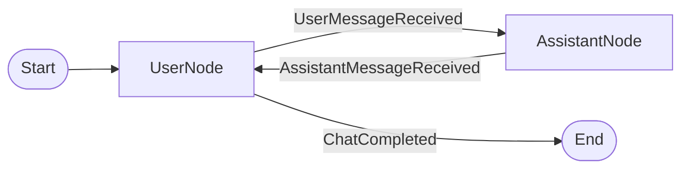

# Chat Example

Simple chat application using ClearFlow's message-driven architecture.

## Flow



## Quick Start

```bash
# From project root directory

# 1. Set up your OpenAI API key
cp .env.example .env
# Edit .env and add your OPENAI_API_KEY

# 2. Install dependencies
uv sync --all-extras

# 3. Run the example
cd examples/chat
uv run python main.py
```

## How It Works

This example shows how to build a chat application with ClearFlow:

1. **UserNode** - Handles user input from the console
2. **AssistantNode** - Calls OpenAI API to generate responses
3. Messages flow back and forth until the user types "quit", "exit", or "bye"

A simple spinner shows while waiting for the API response.

## Key Features

- **Message-driven flow** - Commands and Events route the conversation
- **Simple I/O** - Console input/output with a spinner during API calls
- **Type-safe** - Full typing for all messages and nodes
- **Minimal code** - Just two nodes alternating in a flow

## Files

- `main.py` - Entry point and environment setup
- `chat_flow.py` - Flow definition with simple spinner
- `nodes.py` - UserNode and AssistantNode implementations
- `messages.py` - Message types for the conversation
