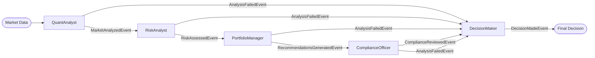

# Portfolio Analysis Example (DSPy-enabled)

Multi-specialist workflow for portfolio allocation decisions using message-driven architecture with DSPy-powered analysis.

## Flow



## Quick Start

```bash
# From project root directory

# 1. Set up your OpenAI API key
cp .env.example .env
# Edit .env and add your API key

# 2. Install dependencies
uv sync --all-extras

# 3. Run the example
cd examples/portfolio_analysis
python main.py  # If venv is activated
# Or: uv run python main.py
```

## How It Works

This example demonstrates a message-driven workflow where each specialist node analyzes data and publishes events describing outcomes:

1. **QuantAnalyst** - Analyzes market data and publishes identified opportunities
2. **RiskAnalyst** - Assesses portfolio risk and publishes risk metrics
3. **PortfolioManager** - Optimizes allocations and publishes recommendations
4. **ComplianceOfficer** - Reviews compliance and publishes approved allocations
5. **DecisionMaker** - Makes final decision and publishes executable orders

Each node uses DSPy for structured LLM outputs with comprehensive error handling.

## Key Features

- **Message-driven** - Single command starts flow, all subsequent messages are events
- **AI-powered analysis** - OpenAI/DSPy integration for structured outputs
- **Type-safe messages** - Immutable dataclasses with Mapping types
- **Error recovery** - AnalysisFailedEvent routes to DecisionMaker for conservative handling
- **No orchestrators** - Direct event routing, flow definition is the sole orchestrator
- **Observable** - Compatible with ClearFlow's Observer pattern (no console logging in nodes)

## Architecture Principles

### Message-Driven Design

- **Single initiating command**: `StartAnalysisCommand` contains all initial context
- **Events describe outcomes**: Past-tense naming (MarketAnalyzedEvent, not AnalyzeMarketEvent)
- **No intermediate commands**: Events flow directly between nodes
- **Explicit routing**: Flow definition specifies all event routes

### Message Design (No God-Objects)

```python
# ✅ GOOD: Focused events with single responsibility
@dataclass(frozen=True)
class MarketAnalyzedEvent(Event):
    insights: QuantInsights  # AI-generated analysis insights
    market_data: MarketData  # Original data for downstream stages
    constraints: PortfolioConstraints  # Constraints for subsequent nodes

# Where QuantInsights is a focused model:
@dataclass(frozen=True)
class QuantInsights:
    market_trend: Literal["bullish", "bearish", "neutral"]
    confidence: float
    top_signals: Sequence[MarketSignal]
    volatility_index: float

# ❌ BAD: God-object with everything embedded
class AnalysisCompleteEvent(Event):
    all_analysis_data: dict  # Everything in one place
    full_market_data: MarketData
    complete_insights: dict  # Unstructured data
    # Too much responsibility!
```

## Files

- `main.py` - Entry point with DSPy configuration and scenario selection
- `portfolio_flow.py` - Message-driven flow definition (no orchestrators)
- `messages.py` - Immutable message types with structured data models
- `nodes.py` - Specialist nodes with DSPy predictors (no console logging)
- `market_data.py` - Market data generation for different scenarios
- `specialists/` - DSPy signatures and models for each specialist

## Design Philosophy

### Message-Driven Architecture

- Events carry only essential data
- Nodes produce new events without mutation
- Explicit data flow via messages
- Type-safe routing based on message types
- Single responsibility per node
