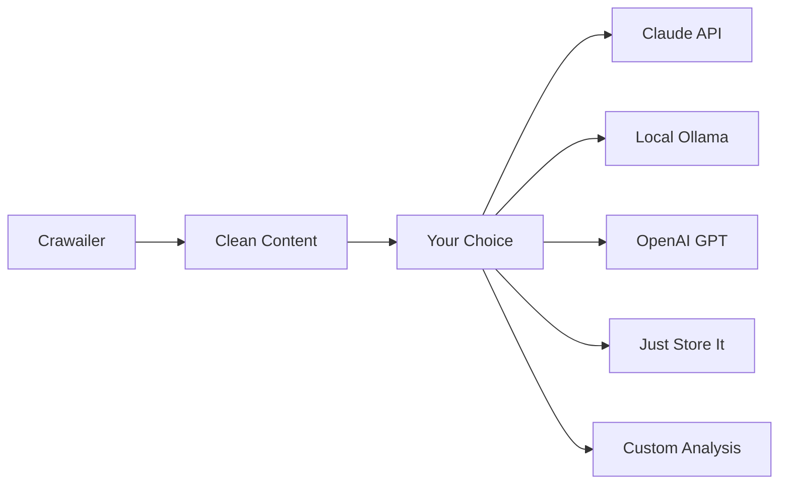
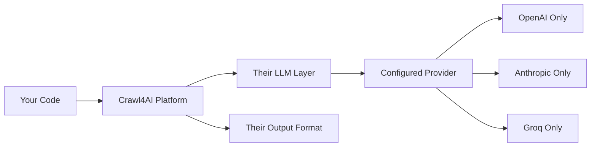

# 🥊 Crawailer vs Other Web Scraping Tools

**TL;DR**: Crawailer follows the UNIX philosophy - do one thing exceptionally well. Other tools try to be everything to everyone.

## 🎯 Philosophy Comparison

| Tool | Philosophy | What You Get |
|------|------------|--------------|
| **Crawailer** | UNIX: Do one thing well | Clean content extraction → **your choice** what to do next |
| **Crawl4AI** | All-in-one AI platform | Forced into their LLM ecosystem before you can scrape |
| **Selenium** | Swiss Army knife | Browser automation + you build everything else |
| **requests/httpx** | Minimal HTTP | Raw HTML → **massive** parsing work required |

## ⚡ Getting Started Comparison

### Crawailer (UNIX Way)
```bash
pip install crawailer
crawailer setup  # Just installs browsers - that's it!
```

```python
content = await web.get("https://example.com")
# Clean, ready-to-use content.markdown
# YOUR choice: Claude, GPT, local model, or just save it
```

### Crawl4AI (Kitchen Sink Way)
```bash
# Create API key file with 6+ providers
cp .llm.env.example .llm.env
# Edit: OPENAI_API_KEY, ANTHROPIC_API_KEY, GROQ_API_KEY...
docker run --env-file .llm.env unclecode/crawl4ai

# Then configure LLM before you can scrape anything
llm_config = LLMConfig(provider="openai/gpt-4o-mini", api_token=os.getenv("OPENAI_API_KEY"))
```

### Selenium (DIY Everything)
```python
from selenium import webdriver
from selenium.webdriver.common.by import By
from selenium.webdriver.support.ui import WebDriverWait
# 50+ lines of boilerplate just to get started...
```

### requests (JavaScript = Game Over)
```python
import requests
response = requests.get("https://react-app.com")
# Result: <div id="root"></div> 😢
```

## 🔧 Configuration Complexity

### Crawailer: Zero Config
```python
# Works immediately - no configuration required
import crawailer as web
content = await web.get("https://example.com")
```

### Crawl4AI: Config Hell
```yaml
# config.yml required
app:
  title: "Crawl4AI API"
  host: "0.0.0.0"
  port: 8020
  
llm:
  provider: "openai/gpt-4o-mini"
  api_key_env: "OPENAI_API_KEY"
  
# Plus .llm.env file with multiple API keys
```

### Selenium: Browser Management Nightmare
```python
options = webdriver.ChromeOptions()
options.add_argument("--headless")
options.add_argument("--no-sandbox")
options.add_argument("--disable-dev-shm-usage")
# 20+ more options for production...
```

## 🚀 Performance & Resource Usage

| Tool | Startup Time | Memory Usage | JavaScript Support | AI Integration | Learning Curve |
|------|-------------|--------------|-------------------|-----------------|----------------|
| **Crawailer** | ~2 seconds | 100-200MB | ✅ **Native** | 🔧 **Your choice** | 🟢 **Minimal** |
| **Crawl4AI** | ~10-15 seconds | 300-500MB | ✅ Via browser | 🔒 **Forced LLM** | 🔴 **Complex** |
| **Playwright** | ~3-5 seconds | 150-300MB | ✅ **Full control** | ❌ None | 🟡 **Moderate** |
| **Scrapy** | ~1-3 seconds | 50-100MB | 🟡 **Splash addon** | ❌ None | 🔴 **Framework** |
| **Selenium** | ~5-10 seconds | 200-400MB | ✅ Manual setup | ❌ None | 🔴 **Complex** |
| **BeautifulSoup** | ~0.1 seconds | 10-20MB | ❌ **None** | ❌ None | 🟢 **Easy** |
| **requests** | ~0.1 seconds | 5-10MB | ❌ **Game over** | ❌ None | 🟢 **Simple** |

## 🎪 JavaScript Handling Reality Check

### React/Vue/Angular App Example
```html
<!-- What the browser renders -->
<div id="app">
  <h1>Product: Amazing Widget</h1>
  <p class="price">$29.99</p>
  <button onclick="addToCart()">Add to Cart</button>
</div>
```

### Tool Results:

**requests/httpx:**
```html
<div id="app"></div>
<!-- That's it. Game over. -->
```

**Scrapy:**
```python
# Requires Scrapy-Splash for JavaScript - complex setup
# settings.py
SPLASH_URL = 'http://localhost:8050'
DOWNLOADER_MIDDLEWARES = {
    'scrapy_splash.SplashCookiesMiddleware': 723,
    'scrapy_splash.SplashMiddleware': 725,
}
# Then in spider - still might not get dynamic content
```

**Playwright (Raw):**
```python
# Works but verbose for simple content extraction
async with async_playwright() as p:
    browser = await p.chromium.launch()
    page = await browser.new_page()
    await page.goto("https://example.com")
    await page.wait_for_selector(".price")
    price = await page.text_content(".price")
    await browser.close()
# Manual HTML parsing still required
```

**BeautifulSoup:**
```python
# Can't handle JavaScript at all
html = requests.get("https://react-app.com").text
soup = BeautifulSoup(html, 'html.parser')
print(soup.find('div', id='app'))
# Result: <div id="app"></div> - empty
```

**Selenium:**
```python
# Works but requires manual waiting and complex setup
wait = WebDriverWait(driver, 10)
price = wait.until(EC.presence_of_element_located((By.CLASS_NAME, "price")))
# Plus error handling, timeouts, element detection...
```

**Crawl4AI:**
```python
# Works but forces you through LLM configuration first
llm_config = LLMConfig(provider="openai/gpt-4o-mini", api_token="sk-...")
# Then crawling works, but you're locked into their ecosystem
```

**Crawailer:**
```python
# Just works. Clean output. Your choice what to do next.
content = await web.get("https://example.com")
print(content.markdown)  # Perfect markdown with price extracted
print(content.script_result)  # JavaScript data if you need it
```

## 🛠️ Real-World Use Cases

### Scenario: Building an MCP Server

**Crawailer Approach (UNIX):**
```python
# Clean, focused MCP server
@mcp_tool("web_extract")
async def extract_content(url: str):
    content = await web.get(url)
    return {
        "title": content.title,
        "markdown": content.markdown,
        "word_count": content.word_count
    }
# Uses any LLM you want downstream
```

**Crawl4AI Approach (Kitchen Sink):**
```python
# Must configure their LLM system first
llm_config = LLMConfig(provider="openai/gpt-4o-mini", api_token=os.getenv("OPENAI_API_KEY"))
# Now locked into their extraction strategies
# Can't easily integrate with your preferred AI tools
```

### Scenario: AI Training Data Collection

**Crawailer:**
```python
# Collect clean training data
urls = ["site1.com", "site2.com", "site3.com"]
contents = await web.get_many(urls)

for content in contents:
    # YOUR choice: save raw, preprocess, or analyze
    training_data.append({
        "source": content.url,
        "text": content.markdown,
        "quality_score": assess_quality(content.text)
    })
```

**Others:** Either can't handle JavaScript (requests) or force you into their AI pipeline (Crawl4AI).

## 💡 When to Choose What

### Choose Crawailer When:
- ✅ You want JavaScript execution without complexity
- ✅ Building MCP servers or AI agents
- ✅ Need clean, LLM-ready content extraction  
- ✅ Want to compose with your preferred AI tools
- ✅ Following UNIX philosophy in your architecture
- ✅ Building production systems that need reliability

### Choose Crawl4AI When:
- 🤔 You want an all-in-one solution (with vendor lock-in)
- 🤔 You're okay configuring multiple API keys upfront
- 🤔 You prefer their LLM abstraction layer

### Choose Scrapy When:
- 🕷️ Building large-scale crawling pipelines
- 🔧 Need distributed crawling across multiple machines
- 📊 Want built-in data pipeline and item processing
- ⚙️ Have DevOps resources for Splash/Redis setup

### Choose Playwright (Raw) When:
- 🎭 Need fine-grained browser control for testing
- 🔧 Building complex automation workflows
- 📸 Require screenshots, PDFs, or recording
- 🛠️ Have time to build content extraction yourself

### Choose BeautifulSoup When:
- 📄 Scraping purely static HTML sites
- 🚀 Need fastest possible parsing (no JavaScript)
- 📚 Working with local HTML files
- 🧪 Learning web scraping concepts

### Choose Selenium When:
- 🔧 You need complex user interactions (form automation)
- 🧪 Building test suites for web applications  
- 🕰️ Legacy projects already using Selenium
- 📱 Testing mobile web applications

### Choose requests/httpx When:
- ⚡ Scraping static HTML sites (no JavaScript)
- ⚡ Working with APIs, not web pages
- ⚡ Maximum performance for simple HTTP requests

## 🏗️ Architecture Philosophy

### Crawailer: Composable Building Block


### Crawl4AI: Monolithic Platform


## 🎯 The Bottom Line

**Crawailer** embodies the UNIX philosophy: **do web scraping and JavaScript execution exceptionally well**, then get out of your way. This makes it the perfect building block for any AI system, data pipeline, or automation workflow.

**Other tools** either can't handle modern JavaScript (requests) or force architectural decisions on you (Crawl4AI) before you can extract a single web page.

When you need reliable content extraction that composes beautifully with any downstream system, choose the tool that follows proven UNIX principles: **Crawailer**.

---

*"The best programs are written so that computing machines can perform them quickly and so that human beings can understand them clearly."* - Donald Knuth

Crawailer: Simple to understand, fast to execute, easy to compose. 🚀