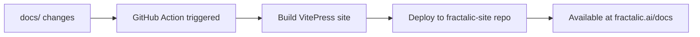

# Documentation Deployment Setup

This guide explains how the Fractalic documentation is automatically deployed to `fractalic.ai/docs`.

## How it Works

The documentation deployment uses GitHub Actions to:

1. **Build**: Compile VitePress documentation from `/docs` folder
2. **Deploy**: Push built files to the main site repository
3. **Serve**: Make docs available at `fractalic.ai/docs`

## Deployment Flow



## Setup Requirements

### 1. GitHub Token

You need to create a Personal Access Token with `repo` permissions:

1. Go to GitHub Settings > Developer settings > Personal access tokens
2. Generate new token with `repo` scope
3. Add it as repository secret named `DEPLOY_TOKEN`

### 2. Repository Settings

In the `fractalic-site` repository:
- Enable GitHub Pages (if using Pages for deployment)
- Configure the deployment branch (usually `gh-pages` or `main`)

## Manual Deployment

To manually deploy documentation:

```bash
# Navigate to docs folder
cd docs

# Install dependencies
npm install

# Build for production
npm run build

# The built files will be in .vitepress/dist/
```

## Local Development

```bash
# Start development server
cd docs
npm run dev

# Open http://localhost:5173
```

## Deployment Targets

The GitHub Action deploys to two locations:

1. **GitHub Pages**: `https://fractalic-ai.github.io/fractalic/` (backup)
2. **Main Site**: `https://fractalic.ai/docs` (primary)

## Triggering Deployment

Documentation deployment is triggered by:
- Push to `main` or `develop` branches with changes in `docs/` or `docs-temp/`
- Manual workflow dispatch
- Pull requests (build only, no deployment)

## Troubleshooting

### Build Fails
- Check that all markdown links are valid
- Ensure VitePress config is correct
- Verify Node.js version compatibility

### Deployment Fails
- Check `DEPLOY_TOKEN` secret is valid
- Verify target repository permissions
- Check GitHub Pages settings in target repo

### Links Don't Work
- Ensure base path is set correctly in VitePress config
- Check that relative links use proper syntax
- Verify image paths are correct for subdirectory deployment
