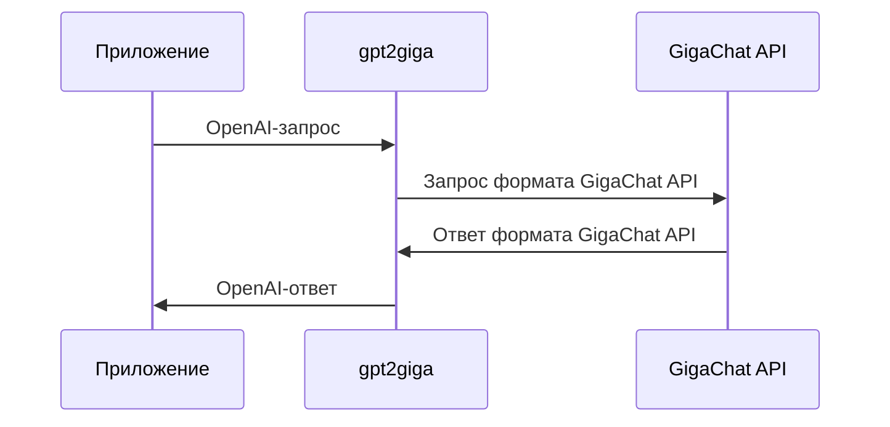

# Утилита для проксирования OpenAI-запросов в GigaChat

Утилита gpt2giga — это прокси-сервер, который перенаправляет запросы, отправленные в OpenAI API, в GigaChat API.

При старте утилиты запускается HTTP-сервер, адрес которого нужно использовать вместо адреса OpenAI API, заданного в вашем приложении (например, `https://api.openai.com/v1/`).
Утилита обработает запрос и перенаправит его заданной [модели GigaChat](https://developers.sber.ru/docs/ru/gigachat/models).
После получения ответа модели, она передаст его в приложение в формате OpenAI.

Утилита работает как с запросами на генерацию, так и с запросами на создание эмбеддингов (эндпоинты `/embeddings` или `/v1/embeddings`).

Общая схема работы gpt2giga:



## Возможности gpt2giga

С помощью gpt2giga вы можете:

- использовать возможности моделей OpenAI и полностью заменить ChatGPT на GigaChat;
- вызывать функции через API, включая передачу и выполнение функций с аргументами;
- обрабатывать ответ модели в режиме потоковой генерации токенов с помощью параметра `stream=true`;
- перенаправлять запросы на создание эмбеддингов (поддерживаются эндпоинты `/embeddings` и `/v1/embeddings`);
- работать в асинхронном режиме с множеством потоков запросов от нескольких клиентов;
- отображать подробные сведения о запросах и ответах при включенном verbose-режиме логирования;
- задавать параметры работы как с помощью аргументов командной строки, так и с помощью переменных окружения (`.env`).

## Начало работы

Утилиту можно запустить как в контейнере, с помощью Docker, так и локально.

### Запуск в Docker

1. Переименуйте файл [`.env.example`](./.env.example) в `.env`.

   ```sh
   cp .env.example .env
   ```

2. В файле `.env` укажите данные для авторизации в GigaChat API.

   GigaChat API поддерживает различные способы авторизации, которые отличаются в зависимости от типа вашей учетной записи. Пример с `Authorization key`.

   ```
   PROXY_HOST=0.0.0.0
   GIGACHAT_CREDENTIALS=<Authorization key GigaChat API>
   GIGACHAT_SCOPE=<your_api_scope>
   GIGACHAT_MODEL=GigaChat
   GIGACHAT_VERIFY_SSL_CERTS=False
   ```

3. Запустите контейнер с помощью Docker Compose: `docker-compose up -d`

### Локальный запуск

Для локального запуска:

1. Установите пакет gpt2giga с помощью менеджера пакетов pip:
   
   ```sh
   pip install gpt2giga
   ```
   
   Вы также можете использовать исходники:
   
   ```sh
   pip install git+https://github.com/ai-forever/gpt2giga.git
   ```

   После установки пакета вы сможете использовать команду `gpt2giga`, которая позволяет запускать и настраивать прокси-сервер.

2. Переименуйте файл [`.env.example`](./.env.example) в `.env` и сохраните его в корне своего проекта:

   ```sh
   cp .env.example .env
   ```

3. В файле `.env` укажите данные для авторизации в GigaChat API.

   GigaChat API поддерживает различные способы авторизации, которые отличаются в зависимости от типа вашей учетной записи.

   > [!NOTE]
   > Кроме переменных gpt2giga в `.env` можно указать переменные окружения, которые поддерживает [python-библиотека GigaChat](https://github.com/ai-forever/gigachat#настройка-переменных-окружения).


4. В терминале выполните команду `gpt2giga`.

Запустится прокси-сервер, по умолчанию доступный по адресу `localhost:8090`.
Адрес и порт сервера, а также другие параметры, можно настроить с помощью аргументов командной строки или переменных окружения.

## Изменение параметров gpt2giga

Вы можете изменять параметры работы утилиты с помощью аргументов командной строки или переменных окружения.

### Аргументы командной строки

Утилита поддерживает аргументы:

- `--host <HOST>` — хост, на котором запускается прокси-сервер. По умолчанию `localhost`;
- `--port <PORT>` — порт, на котором запускается прокси-сервер. По умолчанию `8090`;
- `--mtls-ca-cert-path` - путь к файлу сертификата mTLS корневого центра сертификации;
- `--mtls-cert-file-path` - путь к клиентский сертификату mTLS;
- `--mtls-key-file-path` - путь к закрытому ключу mTLS;
- `--verbose` — включить подробный вывод логов (запросы и ответы);
- `--pass-model` — передавать в GigaChat API модель, которую указал клиент в поле `model` в режиме чата;
- `--pass-token` — передавать токен, полученный в заголовке `Authorization`, в GigaChat API. С помощью него можно настраивать передачу ключей в GigaChat через `OPENAI_API_KEY`;
- `--base-url <BASE_URL>` — базовый URL для GigaChat API. По умолчанию берется значение переменной `GIGACHAT_BASE_URL` или поля `BASE_URL` внутри пакета;
- `--model <MODEL>` — модель для запросов в GigaChat. По умолчанию `GIGACHAT_MODEL`;
- `--timeout <TIMEOUT>` — таймаут для запросов к GigaChat API. По умолчанию `600` секунд;
- `--embeddings <EMBED_MODEL>` — модель, которая будет использоваться для создания эмбеддингов. По умолчанию `EmbeddingsGigaR`;
- `--env-path <PATH>` — путь до файла с переменными окружения `.env`. По умолчанию ищется `.env` в текущей директории
- `--verify-ssl-certs <True/False>` - проверять сертификаты SSL (по умолчанию `True`)
- `--mtls-auth` - использовать аутентификацию по сертефикатам mTLS
- `--enable-images` — экспериментальный флаг, который включает передачу изображений в формате OpenAI в GigaChat API

### Переменные окружения

Для настройки параметров утилиты также можно использовать переменные окружения, заданные в файле `.env`.

Список доступных переменных:

- `PROXY_HOST="localhost"` — хост, на котором запускается прокси-сервер. По умолчанию `localhost`;
- `PROXY_PORT="8090"` — порт, на котором запускается прокси-сервер. По умолчанию `8090`;
- `MTLS_CA_CERT_PATH` - путь к файлу сертификата корневого центра сертификации;
- `MTLS_CERT_FILE_PATH` - путь к клиентский сертификату;
- `MTLS_KEY_FILE_PATH` - путь к закрытому ключу;
- `GPT2GIGA_VERBOSE="False"` — включает/отключает вывод подробной информации;
- `GPT2GIGA_PASS_MODEL="False"` — передавать ли модель, указанную в запросе, непосредственно в GigaChat;
- `GPT2GIGA_PASS_TOKEN="False"` — передавать токен, полученный в заголовке `Authorization`, в GigaChat API;
- `GIGACHAT_BASE_URL="https://gigachat.devices.sberbank.ru/api/v1"` — базовый URL GigaChat;
- `GIGACHAT_MODEL="GigaChat"` — модель GigaChat API, которая будет обрабатывать запросы по умолчанию;
- `GPT2GIGA_TIMEOUT="600"` — таймаут для запросов к GigaChat API (в секундах);
- `GIGACHAT_MTLS_AUTH` -  использовать аутентификацию по сертефикатам mTLS;
- `GPT2GIGA_EMBEDDINGS="EmbeddingsGigaR"` — модель для создания эмбеддингов.

Также можно использовать переменные, которые поддерживает [библиотека GigaChat](https://github.com/ai-forever/gigachat#настройка-переменных-окружения):

- `GIGACHAT_USER` и `GIGACHAT_PASSWORD` — для авторизации с помощью с помощью логина и пароля;
- `GIGACHAT_CREDENTIALS` и `GIGACHAT_SCOPE` — для авторизации с помощью ключа авторизации;
- `GIGACHAT_ACCESS_TOKEN` — для авторизации с помощью токена доступа, полученного в обмен на ключ;
- `GIGACHAT_CA_BUNDLE_FILE` - путь к файлу сертификата корневого центра сертификации;
- `GIGACHAT_CERT_FILE` - путь к клиентскому сертификату;
- `GIGACHAT_KEY_FILE` - путь к закрытому ключу;
- `GIGACHAT_KEY_FILE_PASSWORD` - пароль от закрытого ключа;
- `GIGACHAT_VERIFY_SSL_CERTS` — для того, что бы проверять SSL сертификаты, по умолчанию `False`.

### Пример запуска утилиты с заданными параметрами

Для запуска прокси-сервера с заданным адресом и портом выполните команду:

```sh
gpt2giga \
    --host 127.0.0.1 \
    --port 8080 \
    --verbose \
    --pass-model \
    --pass-token \
    --base-url https://gigachat.devices.sberbank.ru/api/v1 \
    --model GigaChat-Max \
    --timeout 300 \
    --embeddings EmbeddingsGigaR
```

После запуска сервер будет перенаправлять все запросы, адресованные OpenAI API, в GigaChat API.

## Авторизация с помощью заголовка

Утилита может авторизовать запросы в GigaChat API с помощью данных, полученных в заголовке `Authorization`.

Для этого запустите gpt2giga с аргументом `--pass-token` или задайте переменную окружения `GPT2GIGA_PASS_TOKEN=True`.
Поддерживается авторизация с помощью ключа, токена доступа и логина и пароля.

Возможные варианты содержимого заголовка `Authorization`:

- `giga-cred-<credentials>:<scope>` — авторизация с помощью ключа. Вместо `<scope>` нужно указать версию API, к которой будут выполняться запросы. [Подробнее о ключе авторизации и версии API](https://github.com/ai-forever/gigachat?tab=readme-ov-file#параметры-объекта-gigachat).
- `giga-auth-<access_token>` — при авторизации с помощью токена доступа. Токен доступа получается в обмен на ключ авторизации и действителен в течение 30 минут.
- `giga-user-<user>:<password>` — при авторизации с помощью логина и пароля.

## Совместимые приложения

Таблица содержит приложения, проверенные на совместную работу с gpt2giga.

| Приложение                              | Описание                                                                                                                                           |
| --------------------------------------- | -------------------------------------------------------------------------------------------------------------------------------------------------- |
| [Aider](https://aider.chat/)            | AI-ассистент для написания приложений.<br /> Подробнее о запуске и настройке Aider для работы с gpt2giga — в [README](/integrations/aider)         |
| [n8n](https://n8n.io/)                  | Платформа для создания nocode-агентов                                                                                                              |
| [Cline](https://github.com/cline/cline) | AI-ассистент разработчика                                                                                                                          |
| [OpenHands](https://github.com/All-Hands-AI/OpenHands) | AI-ассистент для разработки<br /> Подробнее о запуске и настройке OpenHands для работы с gpt2giga — в [README](/integrations/openhands)                                                                                                                        |

## Лицензия

Проект распространяется под лицензией MIT.
Подробная информация — в файле [LICENSE](LICENSE).
