# Heimdall MCP Server - Your AI Coding Assistant's Long-Term Memory

[](https://pypi.org/project/heimdall-mcp/)
[](hhttps://github.com/lcbcFoo/heimdall-mcp-server/blob/main/README.mdttps://opensource.org/licenses/Apache-2.0)
[](https://modelcontextprotocol.io/)
[](https://youtu.be/7X1gntAXsao)


**The Problem:** Your AI coding assistant has short-lived memory. Every chat session starts from a blank slate.

**The Solution:** Heimdall gives your LLM a persistent, growing, cognitive memory of your specific codebase, lessons and memories carry over time.


https://github.com/user-attachments/assets/120b3d32-72d1-4d42-b3ab-285e8a711981


## Key Features

- 🧠 **Context-Rich Memory**: Heimdall learns from your documentation, session insights, and development history, allowing your LLM to recall specific solutions and architectural patterns across conversations.
- 📚 **Git-Aware Context**: It indexes your project's entire git history, understanding not just what changed, but also who changed it, when, and context.
- 🔗 **Isolated & Organized**: Each project gets its own isolated memory space, ensuring that context from one project doesn't leak into another.
- ⚡ **Efficient Integration**: Built on the Model Context Protocol (MCP), it provides a standardized, low-overhead way for LLMs to access this powerful memory.

## 🚀 Getting Started

**Prerequisites**: Python 3.11+ and Docker (for Qdrant vector database).

Heimdall provides a unified `heimdall` CLI that manages everything from project setup to MCP integration.

### 1. Install Heimdall

```bash
pip install heimdall-mcp
```

This installs the `heimdall` command-line tool with all necessary dependencies.

### 2. Initialize Your Project

Navigate to your project directory and set up Heimdall:

```bash
cd /path/to/your/project

# Initialize project memory (starts Qdrant, creates collections, sets up config)
heimdall project init
```

This single command interactively builds up everything asking user preferences:
- ✅ Starts Qdrant vector database automatically
- ✅ Creates project-specific memory collections
- ✅ Sets up `.heimdall/` configuration directory
- ✅ Downloads required AI models
- ✅ File monitoring
- ✅ Git hooks
- ✅ MCP integration

**Note: this creates a `.heimdall/` directory in your project for configuration - you should NOT commit this - add to .gitignore!**

## Load Project Knowledge

**Recommended: Use automatic file monitoring** and place files in `.heimdall/docs/`:

```bash
# Copy or symlink your documentation to the monitored directory
ln -r -s my-project-docs ./.heimdall/docs/project-docs

# Start automatic monitoring (files are loaded instantly when changed)
heimdall monitor start
```

**Alternative: Manual loading** for one-time imports:

```bash
# Load documentation and files manually
heimdall load docs/ --recursive
heimdall load README.md
```

Your project's memory is now active and ready for your LLM.

#### Real-time Git Integration

You can parse your entire git history with:

```bash
# Load git commit history
heimdall git-load .
```

You can also install git hooks for automatic memory updates on commits:

```bash
# Install the post-commit hook (Python-based, cross-platform)
heimdall git-hooks install
```

**Note**: If you have existing post-commit hooks, they'll be safely chained and preserved - but proceed carefully.


## 🧹 Cleanup

To remove Heimdall from a project:

```bash
# Navigate to the project you want to clean up
cd /path/to/project

# Cleanup data, remove collections, uninstall git hooks
memory_system project clean
```

This cleanly removes project-specific data while preserving the shared Qdrant instance for other projects.

## ⚙️ How It Works Under the Hood

Heimdall extracts unstructured knowledge from your documentation and structured data from your git history. This information is vectorized and stored in a Qdrant database. The LLM can then query this database using a simple set of tools to retrieve relevant, context-aware information.

```mermaid
graph TD
    %% Main client outside the server architecture
    AI_Assistant["🤖 AI Assistant (e.g., Claude)"]

    %% Top-level subgraph for the entire server
    subgraph Heimdall MCP Server Architecture

        %% 1. Application Interface Layer
        subgraph Application Interface
            MCP_Server["MCP Server (heimdall-mcp)"]
            CLI["CognitiveCLI (heimdall/cli.py)"]
            style MCP_Server fill:#b2ebf2,stroke:#00acc1,color:#212121
            style CLI fill:#b2ebf2,stroke:#00acc1,color:#212121
        end

        %% 2. Core Logic Engine
        style Cognitive_System fill:#ccff90,stroke:#689f38,color:#212121
        Cognitive_System["🧠 CognitiveSystem (core/cognitive_system.py)<br/>"]

        %% 3. Storage Layer (components side-by-side)
        subgraph Storage Layer
            Qdrant["🗂️ Qdrant Storage<br/><hr/>- Vector Similarity Search<br/>- Multi-dimensional Encoding"]
            SQLite["🗃️ SQLite Persistence<br/><hr/>- Memory Metadata & Connections<br/>- Caching & Retrieval Stats"]
        end

        %% 4. Output Formatting
        style Formatted_Response fill:#fff9c4,stroke:#fbc02d,color:#212121
        Formatted_Response["📦 Formatted MCP Response<br/><i>{ core, peripheral }</i>"]

        %% Define internal flow
        MCP_Server -- calls --> CLI
        CLI -- calls --> Cognitive_System

        Cognitive_System -- "1\. Vector search for candidates" --> Qdrant
        Cognitive_System -- "2\. Hydrates with metadata" --> SQLite
        Cognitive_System -- "3\. Performs Bridge Discovery" --> Formatted_Response

    end

    %% Define overall request/response flow between client and server
    AI_Assistant -- "recall_memorie" --> MCP_Server
    Formatted_Response -- "Returns structured memories" --> AI_Assistant

    %% --- Styling Block ---

    %% 1. Node Styling using Class Definitions
    classDef aiClientStyle fill:#dbeafe,stroke:#3b82f6,color:#1e3a8a
    classDef interfaceNodeStyle fill:#cffafe,stroke:#22d3ee,color:#0e7490
    classDef coreLogicStyle fill:#dcfce7,stroke:#4ade80,color:#166534
    classDef qdrantNodeStyle fill:#ede9fe,stroke:#a78bfa,color:#5b21b6
    classDef sqliteNodeStyle fill:#fee2e2,stroke:#f87171,color:#991b1b
    classDef responseNodeStyle fill:#fef9c3,stroke:#facc15,color:#854d0e

    %% 2. Assigning Classes to Nodes
    class AI_Assistant aiClientStyle
    class MCP_Server,CLI interfaceNodeStyle
    class Cognitive_System coreLogicStyle
    class Qdrant qdrantNodeStyle
    class SQLite sqliteNodeStyle
    class Formatted_Response responseNodeStyle

    %% 3. Link (Arrow) Styling
    %% Note: Styling edge label text is not reliably supported. This styles the arrow lines themselves.
    %% Primary request/response flow (links 0 and 1)
    linkStyle 0,1 stroke:#3b82f6,stroke-width:2px
    %% Internal application calls (links 2 and 3)
    linkStyle 2,3 stroke:#22d3ee,stroke-width:2px,stroke-dasharray: 5 5
    %% Internal data access calls (links 4 and 5)
    linkStyle 4,5 stroke:#9ca3af,stroke-width:2px
    %% Final processing call (link 6)
    linkStyle 6 stroke:#4ade80,stroke-width:2px

```



## LLM Tool Reference

You can instruct your LLM to use the following six tools to interact with its memory:

| Tool              | Description                                                          |
| :---------------- | :------------------------------------------------------------------- |
| `store_memory`    | Stores a new piece of information, such as an insight or a solution. |
| `recall_memories` | Performs a semantic search for relevant memories based on a query.   |
| `session_lessons` | Records a key takeaway from the current session for future use.      |
| `memory_status`   | Checks the health and statistics of the memory system.               |
| `delete_memory`   | Delete a specific memory by its unique ID.                          |
| `delete_memories_by_tags` | Delete all memories that have any of the specified tags.    |


## 💡 Best Practices

To maximize the effectiveness of Heimdall:

  * **Provide Quality Documentation:** Think architecture decision records, style guides, and API documentation.
  * **Keep documents updated:** Heilmdall will use documents in `.heimdall/docs` to provide memories - if they are outdated, so will be the memories. We suggest you use symbolic links to your actual docs directory in `.heimdall/docs` so Heimdall automatically refreshes memories with latest document versions.
  * **Maintain Good Git Hygiene:** Write clear and descriptive commit messages. A message like `feat(api): add user authentication endpoint` is far more valuable than `more stuff`.
  * **Set Up Automation:** Use `heimdall monitor start` and `heimdall git-hooks install` for hands-free memory updates.
  * **Guide Your Assistant:** Use a system prompt (like a `CLAUDE.md` file) to instruct your LLM on *how* and *when* to use the available memory tools.
  * **Use Strategic Tagging:** Establish rules for your LLM to tag memories consistently. Use temporary tags like `temp-analysis`, `task-specific`, or `cleanup-after-project` for memories that should be deleted after completion, enabling easy cleanup with `delete_memories_by_tags`.

## 🛠️ Command Reference

### Core Commands

| Command | Description |
| :------ | :---------- |
| `heimdall store <text>` | Store experience in cognitive memory |
| `heimdall recall <query>` | Retrieve relevant memories based on query |
| `heimdall load <path>` | Load files/directories into memory |
| `heimdall git-load [repo]` | Load git commit patterns into memory |
| `heimdall status` | Show system status and memory statistics |
| `heimdall remove-file <path>` | Remove memories for deleted file |
| `heimdall delete-memory <id>` | Delete specific memory by ID |
| `heimdall delete-memories-by-tags --tag <tag>` | Delete memories by tags |
| `heimdall doctor` | Run comprehensive health checks |
| `heimdall shell` | Start interactive memory shell |

### Project Management

| Command | Description |
| :------ | :---------- |
| `heimdall project init` | Initialize project memory with interactive setup |
| `heimdall project list` | List all projects in shared Qdrant instance |
| `heimdall project clean` | Remove project collections and cleanup |

### Vector Database (Qdrant)

| Command | Description |
| :------ | :---------- |
| `heimdall qdrant start` | Start Qdrant vector database service |
| `heimdall qdrant stop` | Stop Qdrant service |
| `heimdall qdrant status` | Check Qdrant service status |
| `heimdall qdrant logs` | View Qdrant service logs |

### File Monitoring

| Command | Description |
| :------ | :---------- |
| `heimdall monitor start` | Start automatic file monitoring service |
| `heimdall monitor stop` | Stop file monitoring service |
| `heimdall monitor restart` | Restart monitoring service |
| `heimdall monitor status` | Check monitoring service status |
| `heimdall monitor health` | Detailed monitoring health check |

### Git Integration

| Command | Description |
| :------ | :---------- |
| `heimdall git-hook install` | Install post-commit hook for automatic memory processing |
| `heimdall git-hook uninstall` | Remove Heimdall git hooks |
| `heimdall git-hook status` | Check git hook installation status |

### MCP Integration

| Command | Description |
| :------ | :---------- |
| `heimdall mcp install <platform>` | Install MCP server for platform (vscode, cursor, claude-code, visual-studio, codex) |
| `heimdall mcp remove <platform>` | Remove MCP integration from platform |
| `heimdall mcp status` | Show installation status for all platforms |
| `heimdall mcp list` | List available platforms and installation status |
| `heimdall mcp generate <platform>` | Generate configuration snippets for manual installation |

#### Platforms

Heimdall MCP server is compatible with any platform that supports STDIO MCP servers. The following platforms are supported for automatic installation using `heimdall mcp` commands.

- `vscode` - Visual Studio Code
- `cursor` - Cursor IDE
- `claude-code` - Claude Code
- `visual-studio` - Visual Studio
- `codex` - Codex CLI (project-local CODEX_HOME config)

## Technology Stack:

- Python 3.11+
- Vector Storage: Qdrant
- Mmeory information and metadata: SQLite
- Embeddings: all-MiniLM-L6-v2
- Sentiment analysis: NRCLex emotion lexicon
- Semantic analysis: spaCy
- Integration: Model Context Protocol (MCP)

## 🗺️Short Term Roadmap

  * [x] ~~Git `post-commit` hook for automatic, real-time memory updates~~ ✅ **Completed**
  * [x] ~~Watcher to auto-detect and load new documents in the `.heimdall-mcp` directory.~~ ✅ **Completed**
  * [x] ~~Release v0.1.0 publicly~~ ✅ **Completed**
  * [x] ~~Heimdall pip package available~~ ✅ **Completed**
  * [x] ~~Simplify installation~~ ✅ **Completed**
  * [x] ~~Delete memories support (manually or by tags - for md docs already supported)~~ ✅ **Completed**

## 🤝 Contributing

We welcome contributions! Please see our [Contributing Guide](CONTRIBUTING.md) for details on:

- Setting up the development environment
- Our dual licensing model
- Code style guidelines
- Pull request process

**Important:** All contributors must agree to our [Contributor License Agreement](CLA.md) before their contributions can be merged.

### Quick Start for Contributors

1. Fork the repository
2. Create a feature branch targeting `dev` (not `main`)
3. Make your changes following our style guidelines
4. Submit a pull request with the provided template
5. Sign the CLA when prompted by the CLA Assistant

For questions, open an issue or start a discussion!

## 📄 License

This project is licensed under the Apache 2.0 License for open source use. See our [Contributing Guide](CONTRIBUTING.md) for information about our dual licensing model for commercial applications.
