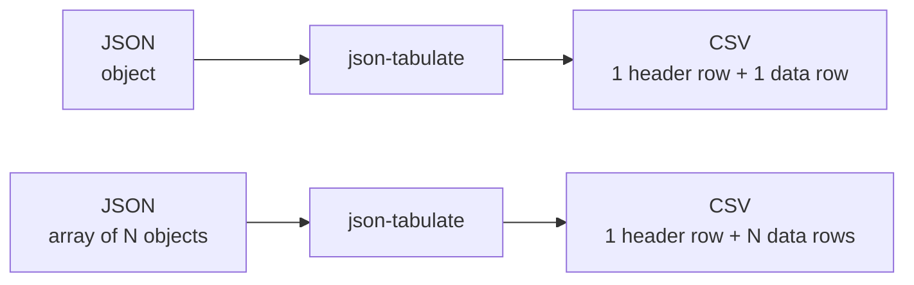

# json-tabulate

`json-tabulate` is a Python library and CLI app that you can use to translate an arbitrarily-nested JSON object—or an array of those objects—into a flat CSV table.



## Examples

### JSON object

It translates this (arbitrarily-nested JSON object):

```json
{
  "a": 1,
  "b": {
    "d": "f",
    "e": ["g", "h", "i"]
  },
  "c": 2
}
```

Into this:

| $.a | $.b.d | $.b.e[0] | $.b.e[1] | $.b.e[2] | $.c |
| --- | ----- | -------- | -------- | -------- | --- |
| 1   | f     | g        | h        | i        | 2 |

<!-- markdownlint-disable -->
<details>
<summary>Show/hide raw CSV string</summary>
<br />

```csv
$.a,$.b.d,$.b.e[0],$.b.e[1],$.b.e[2],$.c
1,f,g,h,i,2
```

</details>
<br />
<!-- markdownlint-enable -->

Each column name is a [JSONPath](https://en.wikipedia.org/wiki/JSONPath) expression
indicating where the value in that column came from.

### JSON array of objects

It translates this (JSON array of arbitrarily-nested objects):

```json
[
  {
    "a": 1,
    "b": 2
  },
  {
    "a": 1,
    "c": ["d", "e", "f"]
  }
]
```

Into this:

| $.a | $.b   | $.c[0]   | $.c[1]   | $.c[2]   |
| --- | ----- | -------- | -------- | -------- |
| 1   | 2     |          |          |          |
| 1   |       | d        | e        | f        |

<!-- markdownlint-disable -->
<details>
<summary>Show/hide raw CSV string</summary>
<br />

```csv
$.a,$.b,$.c[0],$.c[1],$.c[2]
1,2,,,
1,,d,e,f
```

</details>
<br />
<!-- markdownlint-enable -->

Each column name is a [JSONPath](https://en.wikipedia.org/wiki/JSONPath) expression
indicating where the values in that column came from.

## Usage

### Installation

Here's how you can install [`json-tabulate`](https://pypi.org/project/json-tabulate/).

```sh
pip install json-tabulate
```

That will install both the Python library and the command-line app.

### Python library

```py
>>> from json_tabulate.core import translate_json
>>> translate_json(r'{"name": "Ken", "age": 26}')
'$.age,$.name\n26,Ken\n'
```

### CLI app

Here's the usage string displayed by the CLI app:

```sh
json-tabulate --help
```

<!-- 
Note: The usage string below was copy/pasted from the output of
      `$ uv run json-tabulate --help`, when run in a terminal window
      that was 80 pixels wide.
-->

```console
 Usage: json-tabulate [OPTIONS] [JSON_STRING]

 Translate JSON into CSV.

 Usage examples:

  • json-tabulate '{"name": "Ken", "age": 26}' (specify JSON via argument)
  • echo '{"name": "Ken", "age": 26}' | json-tabulate (specify JSON via STDIN)
  • cat input.json | json-tabulate > output.csv (write CSV to file)

╭─ Arguments ──────────────────────────────────────────────────────────────────╮
│   json_string      [JSON_STRING]  JSON string to translate. If not provided, │
│                                   program will read from STDIN.              │
╰──────────────────────────────────────────────────────────────────────────────╯
╭─ Options ────────────────────────────────────────────────────────────────────╮
│ --output-format        [csv|tsv]  Whether you want the output to be          │
│                                   comma-delimited or tab-delimited.          │
│                                   [default: csv]                             │
│ --version                         Show version number and exit.              │
│ --help                            Show this message and exit.                │
╰──────────────────────────────────────────────────────────────────────────────╯
```

## Development

<!-- markdownlint-disable -->
<details>
<summary>Show/hide developer documentation</summary>
<br />
<!-- markdownlint-enable -->

> Using VS Code? The file, `.vscode/tasks.json`, contains VS Code
> [task](https://code.visualstudio.com/docs/debugtest/tasks) definitions for
> several of the commands shown below. You can invoke those tasks via the
> [command palette](https://code.visualstudio.com/api/ux-guidelines/command-palette),
> or—if you have the [Task Runner](https://marketplace.visualstudio.com/items?itemName=SanaAjani.taskrunnercode)
> extension installed—via the "Task Runner" panel.

### Setup Python virtual environment

Here's how you can create a Python virtual environment and install the Python
dependencies within it:

```sh
uv sync
```

### Lint Python source code

```sh
uv run ruff check --fix

# Other option: Do a dry run.
uv run ruff check
```

### Format Python source code

```sh
uv run ruff format

# Other option: Do a dry run.
uv run ruff format --diff
```

### Check data types

```sh
uv run mypy
```

> The default configuration is defined in `pyproject.toml`.

### Run tests

```sh
uv run pytest

# Other option: Run tests and measure code coverage.
uv run pytest --cov

# Other option: Run tests, measure code coverage, and see which lines lack coverage.
uv run pytest --cov --cov-report=term-missing
```

> The default configuration is defined in `pyproject.toml`.

### Build distributable package

```sh
uv build
```

> The build artifacts will be in the `dist/` directory.

</details>
