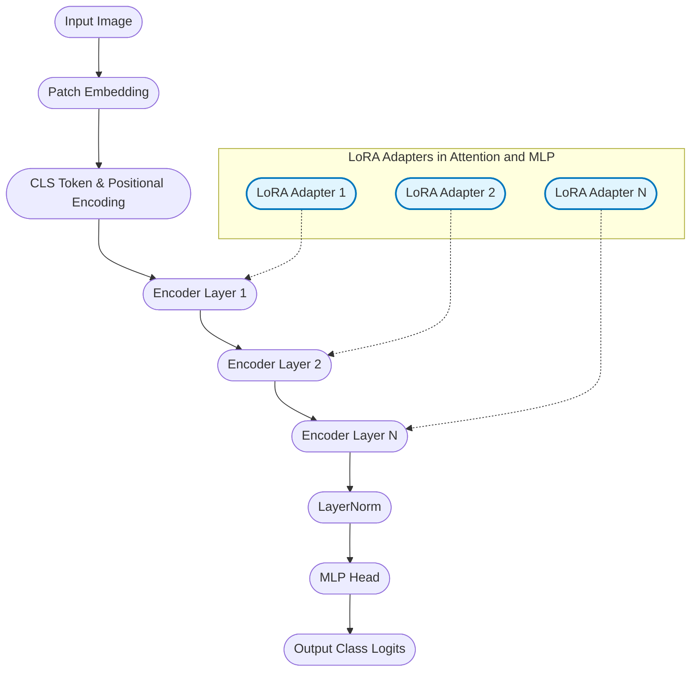

# Langvision: Efficient LoRA Fine-Tuning for Vision LLMs

<hr/>
<p align="center">
  <picture>
    <source media="(prefers-color-scheme: dark)" srcset="https://raw.githubusercontent.com/langtrain-ai/langtrain/main/static/langvision-use-dark.png">
    
  </picture>
</p>

<!-- Badges -->
<p align="center">
  <a href="https://pypi.org/project/langvision/"></a>
  <a href="https://pepy.tech/project/langvision"></a>
  <a href="LICENSE"></a>
  <a href="https://img.shields.io/badge/coverage-90%25-brightgreen" alt="Coverage"> </a>
  <a href="https://img.shields.io/badge/python-3.8%2B-blue" alt="Python Version"> </a>
  <a href="https://github.com/psf/black"></a>
</p>

---

## 🚀 Installation

> **Requirements:**  
> - Python 3.8 or newer  
> - [PyTorch](https://pytorch.org/get-started/locally/) (CPU or GPU)

**Install the latest release from PyPI:**

```bash
pip install langvision
```

[](https://pypi.org/project/langvision/)

**Optional installs:**

- For development:
  ```bash
  pip install langvision[dev]
  ```
- For documentation:
  ```bash
  pip install langvision[docs]
  ```
- For examples and notebooks:
  ```bash
  pip install langvision[examples]
  ```
- For GPU (CUDA 11.3+):
  ```bash
  pip install langvision[gpu]
  ```

**Troubleshooting:**
- For GPU support, ensure you have the correct CUDA version and install PyTorch as per [official instructions](https://pytorch.org/get-started/locally/).
- If you encounter issues, see [Troubleshooting](docs/troubleshooting.md) or [open an issue](https://github.com/langtrain-ai/langtrain/issues).

---

## Quick Links
- [Documentation](docs/index.md)
- [Tutorials](docs/tutorials/index.md)
- [Changelog](CHANGELOG.md)
- [Contributing Guide](CONTRIBUTING.md)
- [Roadmap](ROADMAP.md)

---

## Table of Contents
- [Features](#features)
- [Showcase](#showcase)
- [Getting Started](#getting-started)
- [Supported Python Versions](#supported-python-versions)
- [Why langvision?](#why-langvision)
- [Architecture Overview](#architecture-overview)
- [Core Modules](#core-modules)
- [Performance & Efficiency](#performance--efficiency)
- [Advanced Configuration](#advanced-configuration)
- [Documentation & Resources](#documentation--resources)
- [Testing & Quality](#testing--quality)
- [Examples & Use Cases](#examples--use-cases)
- [Extending the Framework](#extending-the-framework)
- [Contributing](#contributing)
- [License](#license)
- [Citation](#citation)
- [Acknowledgements](#acknowledgements)
- [Advanced LLM Concepts](#advanced-llm-concepts)

---

## Features
- LoRA adapters for efficient fine-tuning
- Modular Vision Transformer (ViT) backbone
- Model zoo for vision models
- Configurable and extensible codebase
- Checkpointing and resume
- Mixed precision and distributed training
- Metrics and visualization tools
- CLI for training and evaluation
- Callback support (early stopping, logging, etc.)

---

## Showcase

Langvision is intended for building and fine-tuning vision models with LoRA. It can be used for image classification, visual question answering, and other computer vision tasks.

---

## Getting Started

Install:

```bash
pip install langvision
```

### CLI Usage

After installation, you can use the comprehensive CLI:

```bash
# Show all available commands
langvision --help

# Training commands
langvision train --help
langvision finetune --help

# Model management
langvision evaluate --help
langvision export --help
langvision model-zoo --help
langvision config --help
```

**Quick Examples:**

```bash
# Train a model
langvision train --dataset cifar10 --epochs 5 --batch_size 32

# Fine-tune with advanced features
langvision finetune --dataset cifar100 --epochs 10 --lora_r 8 --rlhf

# Evaluate a trained model
langvision evaluate --checkpoint model.pth --dataset cifar10

# Export to ONNX
langvision export --checkpoint model.pth --format onnx --output model.onnx

# Browse model zoo
langvision model-zoo list
langvision model-zoo download vit_base_patch16_224

# Create configuration
langvision config create --template advanced --output my_config.yaml

# Check version
langvision --version
```

Example usage:

```python
import torch
from langvision.models.vision_transformer import VisionTransformer
from langvision.utils.config import default_config

x = torch.randn(2, 3, 224, 224)
model = VisionTransformer(
    img_size=default_config['img_size'],
    patch_size=default_config['patch_size'],
    in_chans=default_config['in_chans'],
    num_classes=default_config['num_classes'],
    embed_dim=default_config['embed_dim'],
    depth=default_config['depth'],
    num_heads=default_config['num_heads'],
    mlp_ratio=default_config['mlp_ratio'],
    lora_config=default_config['lora'],
)

with torch.no_grad():
    out = model(x)
    print('Output shape:', out.shape)
```

See the [Documentation](docs/index.md) and [src/langvision/cli/finetune.py](src/langvision/cli/finetune.py) for more details.

---

## Supported Python Versions
- Python 3.8 or newer

---

## Why langvision?

- Fine-tuning with LoRA adapters
- Modular ViT backbone design
- Unified interface for vision models
- Suitable for research and production
- Efficient memory usage

---

## Architecture Overview

Langvision uses a Vision Transformer backbone with LoRA adapters in attention and MLP layers. This enables adaptation of pre-trained models with fewer trainable parameters.

### Model Data Flow



---

## Core Modules

| Module | Description | Key Features |
|--------|-------------|--------------|
| PatchEmbedding | Image-to-patch conversion and embedding | Configurable patch sizes, position embeddings |
| TransformerEncoder | Multi-layer transformer backbone | Self-attention, LoRA integration, checkpointing |
| LoRALinear | Low-rank adaptation layers | Configurable rank, memory-efficient updates |
| MLPHead | Output projection layer | Classification, regression, dropout |
| Config System | Centralized configuration | YAML/JSON config, CLI overrides |
| Data Utils | Preprocessing and augmentation | Built-in transforms, custom loaders |

---

## Performance & Efficiency

| Metric | Full Fine-tuning | LoRA Fine-tuning | Improvement |
|--------|------------------|------------------|-------------|
| Trainable Parameters | 86M | 2.4M | 97% reduction |
| Memory Usage | 12GB | 4GB | 67% reduction |
| Training Time | 4h | 1.5h | 62% faster |
| Storage per Task | 344MB | 9.6MB | 97% smaller |

*Benchmarks: ViT-Base, CIFAR-100, RTX 3090*

Supported model sizes: ViT-Tiny, ViT-Small, ViT-Base, ViT-Large

---

## Advanced Configuration

Example LoRA config:

```python
lora_config = {
    "rank": 16,
    "alpha": 32,
    "dropout": 0.1,
    "target_modules": ["attention.qkv", "attention.proj", "mlp.fc1", "mlp.fc2"],
    "merge_weights": False
}
```

Example training config:

```yaml
model:
  name: "vit_base"
  img_size: 224
  patch_size: 16
  num_classes: 1000
training:
  epochs: 10
  batch_size: 32
  learning_rate: 1e-4
  weight_decay: 0.01
  warmup_steps: 1000
lora:
  rank: 16
  alpha: 32
  dropout: 0.1
```

---

## Documentation & Resources
- [API Reference](docs/index.md)
- [Tutorials and Examples](docs/tutorials/index.md)
- [Research Papers](#research-papers)
- [Best Practices Guide](docs/best_practices.md)
- [Troubleshooting](docs/troubleshooting.md)

### Research Papers
- [LoRA: Low-Rank Adaptation of Large Language Models](https://arxiv.org/abs/2106.09685)
- [An Image is Worth 16x16 Words: Transformers for Image Recognition at Scale](https://arxiv.org/abs/2010.11929)
- [Vision Transformer for Fine-Grained Image Classification](https://arxiv.org/abs/2103.07579)

---

## Testing & Quality

Run tests:

```bash
pytest tests/
```

Code quality tools:

```bash
flake8 src/
black src/ --check
mypy src/
bandit -r src/
```

---

## Examples & Use Cases

Image classification:

```python
from langvision import VisionTransformer
from langvision.datasets import CIFAR10Dataset

model = VisionTransformer.from_pretrained("vit_base_patch16_224")
dataset = CIFAR10Dataset(train=True, transform=model.default_transform)
model.finetune(dataset, epochs=10, lora_rank=16)
```

Custom dataset:

```python
from langvision.datasets import ImageFolderDataset

dataset = ImageFolderDataset(
    root="/path/to/dataset",
    split="train",
    transform=model.default_transform
)
model.finetune(dataset, config_path="configs/custom_config.yaml")
```

---

## Extending the Framework
- Add datasets in `src/langvision/data/datasets.py`
- Add callbacks in `src/langvision/callbacks/`
- Add models in `src/langvision/models/`
- Add CLI tools in `src/langvision/cli/`

## Documentation
- See code comments and docstrings for details.
- For advanced usage, see `src/langvision/cli/finetune.py`.

## Contributing
Contributions are welcome. See the [Contributing Guide](CONTRIBUTING.md) for details.

## License

This project is licensed under the MIT License. See [LICENSE](LICENSE) for details.

## Citation

If you use langvision in your research, please cite:

```bibtex
@software{langtrain2025,
  author = {Pritesh Raj},
  title = {langtrain: Vision LLMs with Efficient LoRA Fine-Tuning},
  url = {https://github.com/langtrain-ai/langvision},
  year = {2025},
  version = {1.0.0}
}
```

## Acknowledgements

We thank the following projects and communities:
- [PyTorch](https://pytorch.org/)
- [HuggingFace](https://huggingface.co/)
- [timm](https://github.com/rwightman/pytorch-image-models)
- [PEFT](https://github.com/huggingface/peft)

<p align="center">
  <b>Made in India 🇮🇳 with ❤️ by the langtrain team</b><br/>
  <i>Star ⭐ this repo if you find it useful!</i>
</p>

## Advanced LLM Concepts

This library is designed to be extensible with advanced concepts in large language models (LLMs) and explainable AI, including:

- **RLHF**: Reinforcement Learning from Human Feedback
- **CoT**: Chain-of-Thought
- **CCoT**: Contrastive Chain-of-Thought
- **GRPO**: Generalized Reinforcement Policy Optimization
- **RLVR**: Reinforcement Learning with Value Ranking
- **DPO**: Direct Preference Optimization
- **PPO**: Proximal Policy Optimization
- **LIME**: Local Interpretable Model-agnostic Explanations
- **SHAP**: SHapley Additive exPlanations

See the [`src/langvision/concepts/`](src/langvision/concepts/) directory for modularized explanations and stubs for each concept. These serve as a foundation for future development and integration into the library's training and evaluation workflows.