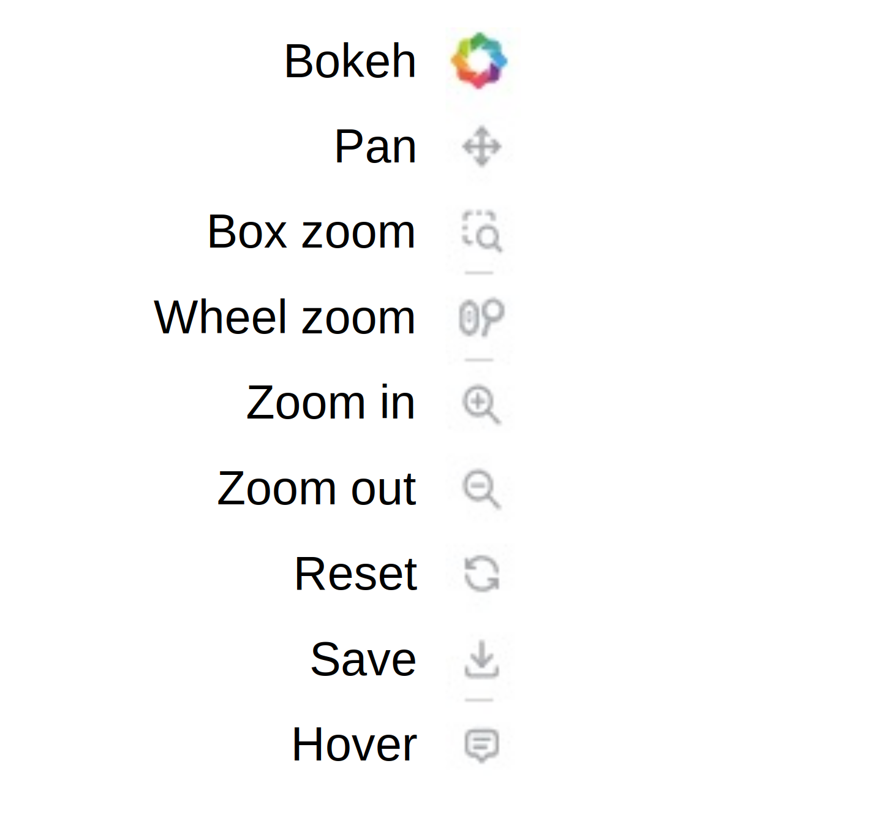

# L200 Monitoring Dashboard

This dashboard shows the status of all L200 detector systems in a semi-live fashion.
The plots are automatically updated every **6 hours** directly from LNGS via `rsync`. So far, the calibration has to be updated manually via the Admin panel.
In case of questions, bug reports or feature requests, please contact [Florian Henkes](mailto:florian.henkes@tum.de) or report in the corresponding Slack channel.

### General information

The dashboard is based on the [Panel](https://panel.holoviz.org/) library and is hosted on a local server at TUM with connection to LNGS. Since the computing power is limited, the number of parallel users is limited to 10 and every session will be discarded after 10 minutes of inactivity. Since regular updates are performed, the dashboard might be unavailable for a few minutes from time to time. Furthermore, the dashboard is not fully optimized for mobile devices, but should work on most. Since there might be updated versions and new releases, the general dashboard access should always be done via the [L200 Monitoring](https://legend.edm.nat.tum.de) link by clicking on the buttons.

---

---

# Documentation

The dashboard is build upon the [GoldenLayout](https://golden-layout.com) framework and therefore designed to be interactive. The following documentation is intended to help you navigate this dashboard.

## General Layout

The dashboard is divided into the three following main sections:

- **Header**: On the upper left corner, you can find the LEGEND logo. You can reload the entire dashboard by simply clicking on it. The header also contains the title of the dashboard and the current time of the last update. Next to this, you will find four widgets that, when clicked, will take you to various LEGEND-related websites, i. e. the GitHub page of the LEGEND experiment, the LEGEND Indico, the Confluence website and the ELOG weblog. In addition, you find a spinning wheel in the right corner which indicates that the dashboard is currently updating the plots.
 

    

 
 

- **Main**: The main panel contains all plots sorted by Germanium detector calibration plots (_Cal._), Physics Monitoring plots for HPGe detector (_Phy._), SiPM monitoring plots (_SiPM_), Muon veto monitoring plots (_Muon_), LLama monitoring plots (_Llama_) as well as this General panel (_General_) and a Metadata tab (_Metadata_) which also contains detector visualizations. You can move the different tabs by dragging them, just like the tabs in your internet browser, and create your own custom layout for working with the plots to display different plots at the same time. You can also close the tabs, see green arrow, or maximize the window, see red arrow:
 

    

 
 

- **Sidebar**: The sidebar contains general navigation buttons to select a period and a run as well as to control the sorting (i. e. sorting by string, CC4, HV, detector type or DAQ) and the string selection of the HPGe detectors. You can expand and collapse the sidebar selectors by clicking on the small arrow next to the tab name, see green arrow. In addition, you can also maximize the sidebar by clicking on the maximize buttons in right corners, see red arrow. The buttons change all plots at once why it takes some time to update all plots since all data has to be reloaded. As mentionend above, the status can be seen by the spinning wheel in the upper right corner.
 

    

 

---

## Interactivity

### Main Panel

As already mentioned, the different tabs in the main panel each contain the plots from the same area, i. e. Germanium detector calibration plots (_Cal._), Physics Monitoring plots for HPGe detector (_Phy._), SiPM monitoring plots (_SiPM_), Muon veto monitoring plots (_Muon_), LLama monitoring plots (_Llama_). In each tab you have the possibility to choose between further different data visualisations, e.g. for the tab _Cal. Tracking_:
 

    

 
Furthermore, you can sometimes select specific time windows and other settings such as relative or absolute values or a histogram representation etc.

### Widgets

The _Cal. Details_ plots are generated independently of this dashboard and cannot be changed. All plots besides them, however, are build upon the [Bokeh](https://docs.bokeh.org/en/latest/index.html) library and are therefore interactive. Each Bokeh plot gives you the possibility to interact with the data which is indicated by the widget bar on the right side or above the plot. You can activate a tool by simply clicking on the tool. An activated tool is indicated by a blue line as shown here:
 

    

 
The tools available are the following ones - but note that not all tools are available for every plot:
 

    

 

- The bokeh widget takes you to the Bokeh website, where you can also find more detailed documentation.
   

- If you activate the pan tool, you can move the data by clicking and dragging the plot with your mouse.
   

- With the box zoom tool you can draw a rectangle in the plot to zoom in.
 

    

 

- The wheel zoom tool allows you to zoom in and out of the y-axis using the mouse wheel. It is activated by default, which is indicated by the blue line.
   

- Also, the magnifying glass button (zoom in and zoom out tool) allows you to zoom in or out of the y-axis by a factor of 0.5.
   

- The reset tool allows you to reset the plot to the default view, e. g. if you have zoomed in.
   

- By clicking on the save tool you can save your current plot selection as _PNG_.
   

- In addition, most of the plots have a hover tool which allows you to get more information about the data points by hovering over them with your mouse. This can be (de-)activated by clicking on this button.
   

Last but not least, each legend is interactive so that you can de-select the corresponding data by clicking on the legend entry. This is especially useful if you only want to see a specific detector to show its feature in a specific variable.
 

    

 

---
