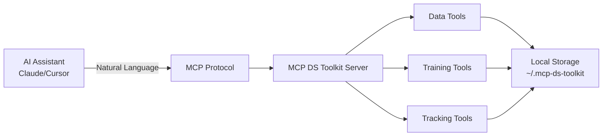

# 🚀 MCP DS Toolkit Server

A **standalone** Model Context Protocol (MCP) server that brings complete DS capabilities to AI assistants like Claude Desktop and Cursor. Build, train, and track ML models through natural language - no external services required!

[](https://modelcontextprotocol.io)
[](#claude-desktop)
[](#cursor-ide)

## 🎯 **What is MCP DS Toolkit Server?**

MCP DS Toolkit Server enables AI assistants to perform complete data science workflows through natural language. Simply talk to Claude or Cursor about what you want to do, and it handles the entire DS pipeline - from data loading to model training and evaluation.

### **Key Capabilities**

✅ **29 DS Tools** - Complete DS workflow from data loading to model evaluation
✅ **Natural Language Interface** - Just describe what you want in plain English
✅ **Zero Configuration** - Works immediately after installation
✅ **Local SQLite Tracking** - No external databases or cloud services needed
✅ **Cross-Platform** - Works on macOS, Linux, and Windows
✅ **AI Assistant Integration** - Seamless with Claude Desktop and Cursor IDE

## 🌟 Why MCP DS Toolkit?

### 🎯 **Transform Your AI Assistant into a Data Scientist**
- **Natural Language DS**: Just describe what you want - "Load the iris dataset and train a random forest classifier"
- **Complete Automation**: Your AI assistant handles data preprocessing, model training, and evaluation
- **Intelligent Recommendations**: Get suggestions for algorithms, hyperparameters, and preprocessing steps
- **Comprehensive Metrics**: Detailed performance metrics, learning curves, and model comparisons

### 🔬 **Enterprise-Ready Features**
- **Production-Quality Code**: Generated code follows best practices and is deployment-ready
- **Comprehensive Tracking**: Every experiment, model, and metric is automatically tracked
- **Reproducible Workflows**: All operations are logged and can be reproduced
- **Local-First Architecture**: Your data never leaves your machine

### 📊 **Complete Tool Suite**
- **Data Management**: Loading, validation, profiling, cleaning, preprocessing
- **Model Training**: 14+ algorithms from scikit-learn with automatic hyperparameter tuning
- **Experiment Tracking**: SQLite-based tracking with full experiment lineage
- **Performance Analysis**: Learning curves, feature importance, and model comparisons

> **Note**: Cloud storage capabilities (AWS S3, Google Cloud, Azure) are available as optional dependencies but not yet fully implemented. Current version focuses on local storage and processing.

## 📋 Prerequisites

### Install uvx (if not already installed)

This project uses `uvx` for easy Python package execution. If you don't have it installed:

#### macOS/Linux
```bash
# Install uv first (if not installed)
curl -LsSf https://astral.sh/uv/install.sh | sh

# uvx comes bundled with uv
```

#### Windows
```bash
# Install uv first (if not installed)
powershell -ExecutionPolicy ByPass -c "irm https://astral.sh/uv/install.ps1 | iex"

# uvx comes bundled with uv
```

#### Alternative: Using pip
If you prefer not to use uvx, you can install directly with pip:
```bash
pip install mcp-ds-toolkit-server
```

Then use `mcp-ds-toolkit-server` as the command instead of `uvx mcp-ds-toolkit-server` in the configuration examples below.

## ⚡ Quick Start

Choose your preferred AI assistant:

### 🤖 Claude Desktop

#### 1. Install the Server (30 seconds)

```bash
# Using uvx (recommended)
uvx mcp-ds-toolkit-server

# Or using pip
pip install mcp-ds-toolkit-server
```

#### 2. Configure Claude Desktop

Add to your Claude Desktop configuration file:

**macOS**: `~/Library/Application Support/Claude/claude_desktop_config.json`
**Windows**: `%APPDATA%\Claude\claude_desktop_config.json`
**Linux**: `~/.config/Claude/claude_desktop_config.json`

**Basic Configuration:**
```json
{
  "mcpServers": {
    "ds-toolkit": {
      "command": "uvx",
      "args": ["mcp-ds-toolkit-server"]
    }
  }
}
```

**With Custom Data Directory:**
```json
{
  "mcpServers": {
    "ds-toolkit": {
      "command": "uvx",
      "args": [
        "mcp-ds-toolkit-server",
        "--mcp-dir",
        "/path/to/your/mcp-data"
      ]
    }
  }
}
```

> **Note**: If you get `uvx ENOENT` errors, use the full path to `uvx` instead. Find it with `which uvx` and replace `"command": "uvx"` with `"command": "/full/path/to/uvx"`. See [troubleshooting section](#uvx-command-not-found-enoent-error) for details.

#### 3. Restart Claude Desktop and Test

```
You: Load the iris dataset and train a random forest classifier
Claude: I'll help you load the iris dataset and train a random forest classifier...
```

### 📝 Cursor IDE

#### 1. Install the Server

```bash
# Using uvx (recommended)
uvx mcp-ds-toolkit-server

# Or using pip
pip install mcp-ds-toolkit-server
```

#### 2. Configure Cursor

Create or edit the MCP configuration file:

**Project-specific**: `.cursor/mcp.json` (in your project root)
**Global**: `~/.cursor/mcp.json` (in your home directory)

**Basic Configuration:**
```json
{
  "mcpServers": {
    "ds-toolkit": {
      "command": "uvx",
      "args": ["mcp-ds-toolkit-server"]
    }
  }
}
```

**With Custom Data Directory:**
```json
{
  "mcpServers": {
    "ds-toolkit": {
      "command": "uvx",
      "args": [
        "mcp-ds-toolkit-server",
        "--mcp-dir",
        "/path/to/your/mcp-data"
      ]
    }
  }
}
```

> **Note**: If you get `uvx ENOENT` errors, use the full path to `uvx` instead. Find it with `which uvx` and replace `"command": "uvx"` with `"command": "/full/path/to/uvx"`. See [troubleshooting section](#uvx-command-not-found-enoent-error) for details.

#### 3. Restart Cursor and Test

Open Cursor's AI chat and try:
```
You: Profile my CSV dataset and show me the correlations
Cursor: I'll analyze your CSV dataset and generate a comprehensive profile...
```

### 🐳 Alternative Installation Methods

#### Development Installation (for contributors)
```bash
git clone https://github.com/Yasserelhaddar/MCP-DS-Toolkit-Server
cd mcp-ds-toolkit-server
uv sync

# Configure with local path
{
  "mcpServers": {
    "ds-toolkit": {
      "command": "uv",
      "args": ["--directory", "/path/to/mcp-ds-toolkit-server", "run", "mcp-ds-toolkit-server"]
    }
  }
}
```

## 🛠️ **Complete Tool Reference**

### 📊 **Data Management Tools (13 tools)**

| Tool | Description | Example Usage |
|------|-------------|---------------|
| `load_dataset` | Load data from CSV, JSON, Excel, sklearn datasets | "Load the iris dataset" |
| `validate_dataset` | Check data quality and integrity | "Validate my dataset for missing values" |
| `profile_dataset` | Generate comprehensive statistics | "Profile the dataset and show correlations" |
| `preprocess_dataset` | Apply scaling, encoding, feature selection | "Preprocess data with standard scaling" |
| `clean_dataset` | Handle missing values and outliers | "Clean the dataset and remove outliers" |
| `split_dataset` | Create train/test/validation splits | "Split data 80/20 for training" |
| `list_datasets` | Show all loaded datasets | "What datasets are available?" |
| `get_dataset_info` | Get detailed dataset information | "Show info about the sales dataset" |
| `compare_datasets` | Compare multiple datasets | "Compare train and test distributions" |
| `batch_process_datasets` | Process multiple datasets at once | "Apply same preprocessing to all datasets" |
| `sample_dataset` | Create dataset samples | "Sample 1000 rows from the dataset" |
| `export_dataset` | Export to various formats | "Export cleaned data to CSV" |
| `remove_dataset` | Remove dataset from memory | "Remove the temporary dataset" |
| `clear_all_data` | Clear all loaded data | "Clear all datasets from memory" |

### 🤖 **Model Training Tools (6 tools)**

| Tool | Description | Example Usage |
|------|-------------|---------------|
| `train_model` | Train ML models with 14+ algorithms | "Train a random forest classifier" |
| `evaluate_model` | Evaluate model performance | "Evaluate the model on test data" |
| `compare_models` | Compare multiple models | "Compare RF, SVM, and XGBoost" |
| `tune_hyperparameters` | Optimize model parameters | "Tune hyperparameters using grid search" |
| `get_model_info` | Get model details and parameters | "Show model configuration" |
| `list_algorithms` | List available algorithms | "What algorithms can I use?" |

### 📈 **Experiment Tracking Tools (10 tools)**

| Tool | Description | Example Usage |
|------|-------------|---------------|
| `create_experiment` | Create new experiment | "Create experiment 'customer_churn_v1'" |
| `start_run` | Start tracking run | "Start a new training run" |
| `log_params` | Log hyperparameters | "Log the model parameters" |
| `log_metrics` | Log performance metrics | "Log accuracy and F1 score" |
| `log_artifact` | Save artifacts (plots, models) | "Save the confusion matrix plot" |
| `end_run` | Complete current run | "End the current run" |
| `list_experiments` | Show all experiments | "List all my experiments" |
| `get_experiment` | Get experiment details | "Show details of the latest experiment" |
| `list_runs` | List experiment runs | "Show all runs for this experiment" |
| `compare_runs` | Compare run metrics | "Compare the last 3 runs" |


## 💬 Example Prompts

### 🎯 **Quick Start Examples**

```yaml
Basic Operations:
  "Load the iris dataset from sklearn"
  "Show me what datasets are currently loaded"
  "Profile my dataset and show key statistics"
  "Train a random forest classifier on the iris data"
  "Evaluate my model and show the confusion matrix"

Data Processing:
  "Load data.csv and check for missing values"
  "Clean the dataset by removing outliers using IQR method"
  "Preprocess the data with standard scaling and one-hot encoding"
  "Split my data into 70% train, 15% validation, 15% test"
  "Handle class imbalance in my dataset"

Model Training:
  "Train multiple models and compare their performance"
  "Perform 5-fold cross-validation on my model"
  "Tune hyperparameters for the random forest using grid search"
  "Show me the feature importance for the trained model"
  "Generate learning curves to check for overfitting"

Experiment Tracking:
  "Create an experiment called 'customer_churn_prediction'"
  "Start tracking this training run"
  "Log the model parameters and performance metrics"
  "Compare the last 5 training runs"
  "Show me all experiments from the past week"
```

### 🔬 **Complete Workflow Example**

Here's a real conversation showing an end-to-end ML pipeline:

```
You: Load the wine dataset from sklearn and give me a comprehensive profile

Claude: I'll load the wine dataset and provide you with a comprehensive profile...
[Loads dataset, generates statistics, correlations, and data quality report]

You: Clean the data and split it for training with 80/20 ratio

Claude: I'll clean the dataset and create train/test splits...
[Handles missing values, removes outliers, splits data]

You: Train and compare Random Forest, SVM, and Gradient Boosting classifiers

Claude: I'll train these three models and compare their performance...
[Trains models, evaluates each, provides comparison table]

You: The Random Forest looks best. Can you tune its hyperparameters?

Claude: I'll optimize the Random Forest hyperparameters using grid search...
[Performs grid search, shows best parameters and improved metrics]

You: Great! Create an experiment called "wine_classification" and log everything

Claude: I'll create the experiment and log all our work...
[Creates experiment, logs parameters, metrics, and artifacts]

You: Show me the learning curves and feature importance

Claude: I'll analyze the model's learning behavior and feature importance...
[Provides learning curve analysis and feature importance rankings]
```

## 🚀 **Supported ML Algorithms**

### Classification Algorithms
- **Tree-Based**: RandomForest, GradientBoosting, ExtraTrees, DecisionTree
- **Linear Models**: LogisticRegression, RidgeClassifier, SGDClassifier
- **Support Vector**: SVC (linear, rbf, poly kernels)
- **Neighbors**: KNeighborsClassifier
- **Naive Bayes**: GaussianNB, MultinomialNB, BernoulliNB

### Regression Algorithms
- **Tree-Based**: RandomForestRegressor, GradientBoostingRegressor, ExtraTreesRegressor
- **Linear Models**: LinearRegression, Ridge, Lasso, ElasticNet
- **Support Vector**: SVR (linear, rbf, poly kernels)
- **Neighbors**: KNeighborsRegressor

## 🏗️ **Architecture**

### How It Works



### Storage Structure

```
~/.mcp-ds-toolkit/
├── experiments.db          # SQLite experiment tracking
├── artifacts/              # Plots, reports, outputs
│   └── {experiment_id}/
│       └── {run_id}/
├── models/                 # Saved ML models
├── datasets/               # Cached datasets
└── cache/                  # Temporary files
```

### Technology Stack

- **Core**: Python 3.12+, MCP Protocol, SQLite
- **ML Framework**: scikit-learn, pandas, numpy
- **Data Processing**: pandas, numpy, scipy
- **No External Dependencies**: Everything runs locally

## 🔧 Troubleshooting

### Common Issues and Solutions

#### Server Not Starting
```bash
# Check Python version (requires 3.12+)
python --version

# Reinstall with verbose output
pip install --verbose mcp-ds-toolkit-server

# Check if the command is available
which mcp-ds-toolkit-server
```

#### uvx Command Not Found (ENOENT Error)
If you see errors like `spawn uvx ENOENT` in Claude Desktop logs, this means `uvx` is not in the system PATH that Claude Desktop can access.

**Solution**: Use the full path to `uvx` in your configuration:

1. **Find your uvx path**:
   ```bash
   which uvx
   # Example output: /Users/username/.pyenv/shims/uvx
   ```

2. **Update your configuration with the full path**:
   ```json
   {
     "mcpServers": {
       "ds-toolkit": {
         "command": "/Users/username/.pyenv/shims/uvx",
         "args": ["mcp-ds-toolkit-server"]
       }
     }
   }
   ```

**Why this happens**: Claude Desktop runs with a limited PATH environment that may not include directories where `uvx` is installed (like `~/.pyenv/shims` for pyenv users, `~/.local/bin`, or other Python tool directories).

#### Claude/Cursor Not Finding Tools
1. **Check configuration file location**:
   - Claude: `~/Library/Application Support/Claude/claude_desktop_config.json`
   - Cursor: `.cursor/mcp.json` or `~/.cursor/mcp.json`

2. **Verify JSON syntax**:
   ```json
   {
     "mcpServers": {
       "ds-toolkit": {
         "command": "uvx",
         "args": ["mcp-ds-toolkit-server"]
       }
     }
   }
   ```

3. **Restart the application** after configuration changes

#### Permission Errors
```bash
# Fix permissions for local storage
chmod -R 755 ~/.mcp-ds-toolkit

# If using pip install
pip install --user mcp-ds-toolkit-server
```

#### Memory Issues with Large Datasets
- Use `sample_dataset` to work with smaller subsets
- Clear unused datasets with `remove_dataset` or `clear_all_data`
- Increase Python memory limit if needed

### Getting Help
- **Issues**: Report bugs on [GitHub Issues](https://github.com/Yasserelhaddar/MCP-DS-Toolkit-Server/issues)

## 🤝 Contributing

We welcome contributions! See [CONTRIBUTING.md](CONTRIBUTING.md) for guidelines.

### Development Setup
```bash
git clone https://github.com/Yasserelhaddar/MCP-DS-Toolkit-Server
cd mcp-ds-toolkit-server
uv sync
uv run pytest
```

## 📄 License

MIT License - see [LICENSE](LICENSE) file for details.

## 🙏 Acknowledgments

Built on these excellent projects:
- [Model Context Protocol](https://modelcontextprotocol.io/) by Anthropic
- [scikit-learn](https://scikit-learn.org/) for ML algorithms
- [SQLite](https://sqlite.org/) for local tracking

---

<div align="center">

**Transform your AI assistant into a complete Data Science toolkit!**

[](https://github.com/Yasserelhaddar/MCP-DS-Toolkit-Server)
[](#-quick-start)
[](#-example-prompts)

</div>
