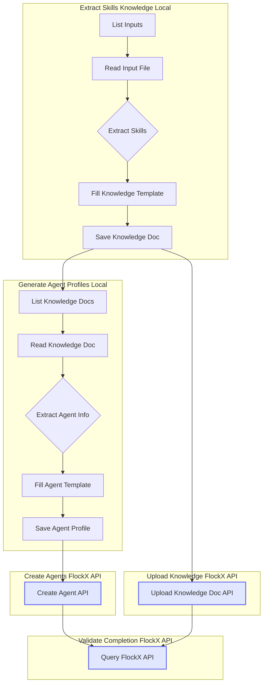

<!-- FlockX Logo: size matches header text -->
<p align="center">
  
  <br/>
  <span style="font-size: 1em; font-style: italic; color: #555;">FlockX MCP Server</span>
</p>

# FlockX MCP Server

> **Legendary AI Agent Creation & Knowledge Ingestion for Cursor and Claude Desktop**
> and so, so, so much more

---

## 🚀 Overview

This repository provides a Model Context Protocol (MCP) server for FlockX, enabling you to manage, train, and validate AI agents through a seamless conversational interface—right inside your development environment (Cursor) or Claude Desktop. With simple Markdown processes and best-practice templates, you can automate agent creation, knowledge ingestion, and validation with ease.

---

## 🛠️ Installation & Setup

### Prerequisites

- Python 3.7+
- pip
- FlockX API key

### 1. Clone & Install

```bash
git clone <repository-url>
cd mcp-server-flockx
python -m venv .venv
source .venv/bin/activate  # On Unix/macOS
# or
.venv\Scripts\activate  # On Windows
pip install -r requirements.txt
```

### 2. Configure Your API Key

Create a `.env` file in the project root:

```bash
FLOCKX_API_KEY=your_api_key_here
```

---

## 🖥️ Integrate with Cursor IDE

1. Open (or create) `.cursor/mcp.json` in your project root, or `~/.cursor/mcp.json` for global config.
2. Add your MCP server config:

```json
{
  "mcpServers": {
    "flockx-mcp": {
      "command": "/absolute/path/to/.venv/bin/python",
      "args": ["/absolute/path/to/run.py"],
      "env": {
        "FLOCKX_API_KEY": "your_api_key_here"
      }
    }
  }
}
```

3. Restart Cursor. Your FlockX MCP tools will appear in the tools panel.

---

## 💬 Integrate with Claude Desktop

1. Open Claude Desktop → Settings → Developer → Edit Config.
2. Add to `claude_desktop_config.json`:

```json
{
  "mcpServers": {
    "flockx-mcp": {
      "command": "/absolute/path/to/.venv/bin/python",
      "args": ["/absolute/path/to/run.py"],
      "env": {
        "FLOCKX_API_KEY": "your_api_key_here"
      }
    }
  }
}
```

3. Save and restart Claude Desktop. Look for the MCP tools icon in chat.

---

## 🤖 Why Use the flockx MCP Server?

Working with the flockx MCP server in Cursor or Claude Desktop unlocks a new paradigm:

- **Conversational Training:** Interact with your agent, teach new skills, and ingest knowledge—all through natural language.
- **Process Automation:** Define and run complex workflows using simple Markdown files in `training/processes/`. No code required—just describe your process, and let your AI do the rest.
- **Best Practice Templates:** Use the provided templates in `training/templates/` to ensure every knowledge document and agent profile is structured for success.

You can iteratively build, test, and refine your agents in a collaborative, conversational loop—directly in your favorite environment.

## 🧪 What This Workflow Does For You

When you follow this workflow, the system will:

- **Create test agents in your FlockX account** automatically.
- **Train each agent on your provided profession or domain knowledge** (using your input files and best-practice extraction).
- **Enable you to ask any of your agents questions**—directly in Cursor or Claude Desktop—so you can interact, test, and validate their knowledge in real time.

This makes it easy to prototype, experiment, and iterate on agent skills and knowledge before deploying to production.

---

## 🚀 Full Workflow Overview

See how much gets done with a single command:



---

## 📝 Next Steps: Orchestrate the Full Workflow

To get started with end-to-end agent creation and knowledge ingestion, simply ask your AI assistant (in Cursor or Claude Desktop):

> **"Please follow the instructions in `training/processes/process-overall-agent-knowledge-ingestion.md` to extract, generate, upload, and validate agent knowledge."**

Your AI will guide you through each step, leveraging the Markdown processes and templates provided.

---

## 🛠️ Troubleshooting

- **`FLOCKX_API_KEY` not set:** Ensure you have created a `.env` file in the project root with your `FLOCKX_API_KEY` from FlockX.io.
- **MCP server not responding:** Verify `run.py` is executing in stdio mode via your IDE/terminal.
- **Rate limiting:** If you encounter API rate limits, consider adjusting your workflow or contacting FlockX support.

## 🤝 Contributing
