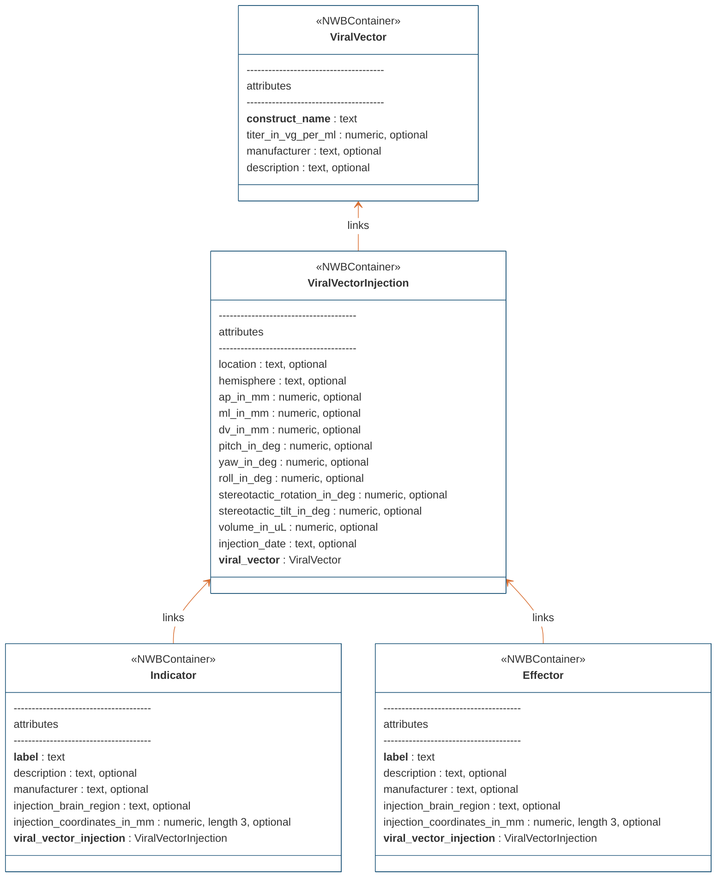
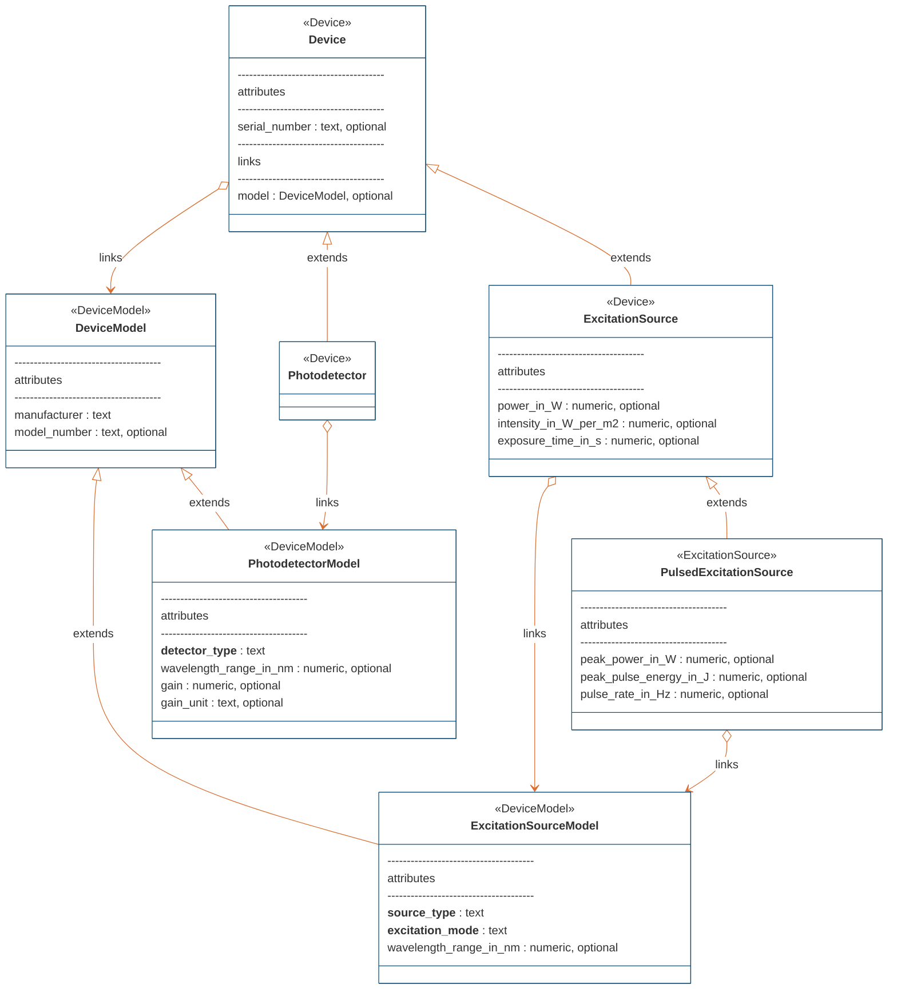
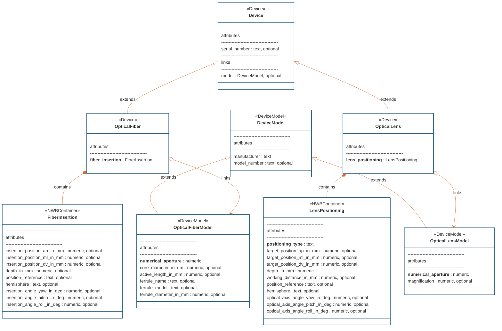
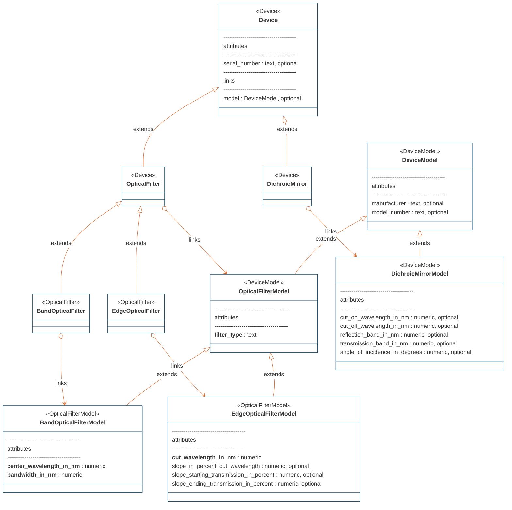

# ndx-ophys-devices Extension for NWB

This is an NWB extension for storing metadata of devices used in optical experimental setup (microscopy, fiber photometry, optogenetic stimulation etc.)

This extension consists of neurodata types in the following categories:

**Container Classes:**
- **ViralVector** extends NWBContainer to hold metadata on viral vectors used for gene delivery.
- **ViralVectorInjection** extends NWBContainer to hold metadata on viral vector injection procedures.
- **Indicator** extends NWBContainer to hold metadata on the fluorescent indicator.
- **Effector** extends NWBContainer to hold metadata on the effector/opsin.
- **LensPositioning** extends NWBContainer to hold metadata on the positioning of a lens relative to the brain.
- **FiberInsertion** extends NWBContainer to hold metadata on the insertion of a fiber into the brain.

**Model Classes:**
- **OpticalFiberModel** extends DeviceModel to hold metadata on the optical fiber model.
- **ExcitationSourceModel** extends DeviceModel to hold metadata on the excitation source model.
- **PhotodetectorModel** extends DeviceModel to hold metadata on the photodetector model.
- **DichroicMirrorModel** extends DeviceModel to hold metadata on the dichroic mirror model.
- **OpticalFilterModel** extends DeviceModel to hold metadata on a general optical filter model.
- **BandOpticalFilterModel** extends OpticalFilterModel to hold metadata on any bandpass or bandstop optical filter models.
- **EdgeOpticalFilterModel** extends OpticalFilterModel to hold metadata on any edge optical filter models.
- **OpticalLensModel** extends DeviceModel to hold metadata on the optical lens model.

**Device Classes:**
- **OpticalFiber** extends Device to hold metadata on optical fibers.
- **ExcitationSource** extends Device to hold metadata on excitation sources.
- **PulsedExcitationSource** extends ExcitationSource to hold metadata on pulsed excitation sources.
- **Photodetector** extends Device to hold metadata on photodetectors.
- **DichroicMirror** extends Device to hold metadata on dichroic mirrors.
- **OpticalFilter** extends Device to hold metadata on general optical filters.
- **BandOpticalFilter** extends OpticalFilter to hold metadata on bandpass or bandstop optical filters.
- **EdgeOpticalFilter** extends OpticalFilter to hold metadata on edge optical filters.
- **OpticalLens** extends Device to hold metadata on optical lenses.

Note that the container classes cannot be directly added to the NWB file, but instead require extending `LabMetaData` to
contain one or more of these container classes in a separate extension. 
For example, see [ndx-optogenetics](https://github.com/rly/ndx-optogenetics). 

## Installation
To install the latest stable release through PyPI,
```bash
pip install ndx-ophys-devices
```

## Usage

```python
import datetime
import numpy as np
from pynwb import NWBFile
from ndx_ophys_devices import (
    # Container classes
    ViralVector,
    ViralVectorInjection,
    Indicator,
    Effector,
    LensPositioning,
    FiberInsertion,
    
    # Model classes
    OpticalFiberModel,
    ExcitationSourceModel,
    PhotodetectorModel,
    DichroicMirrorModel,
    OpticalFilterModel,
    BandOpticalFilterModel,
    EdgeOpticalFilterModel,
    OpticalLensModel,
    
    # Device classes
    OpticalFiber,
    ExcitationSource,
    PulsedExcitationSource,
    Photodetector,
    DichroicMirror,
    OpticalFilter,
    BandOpticalFilter,
    EdgeOpticalFilter,
    OpticalLens,
)

nwbfile = NWBFile(
    session_description='session_description',
    identifier='identifier',
    session_start_time=datetime.datetime.now(datetime.timezone.utc)
)

# Create container objects
viral_vector = ViralVector(
    name="viral_vector",
    description="AAV viral vector for optogenetic stimulation",
    construct_name="AAV-EF1a-DIO-hChR2(H134R)-EYFP",
    manufacturer="Vector Manufacturer",
    titer_in_vg_per_ml=1.0e12,
)

viral_vector_injection = ViralVectorInjection(
    name="viral_vector_injection",
    description="Viral vector injection for optogenetic stimulation",
    location="Hippocampus",
    hemisphere="right",
    reference="Bregma at the cortical surface",
    ap_in_mm=2.0,
    ml_in_mm=1.5,
    dv_in_mm=-3.0,
    pitch_in_deg=0.0,
    yaw_in_deg=0.0,
    roll_in_deg=0.0,
    stereotactic_rotation_in_deg=0.0,
    stereotactic_tilt_in_deg=0.0,
    volume_in_uL=0.45,
    injection_date="1970-01-01T00:00:00+00:00",
    viral_vector=viral_vector,
)

indicator = Indicator(
    name="indicator",
    description="Green indicator",
    label="GCamp6f",
    viral_vector_injection=viral_vector_injection,
)

effector = Effector(
    name="effector",
    description="Excitatory opsin",
    label="hChR2",
    viral_vector_injection=viral_vector_injection,
)

fiber_insertion = FiberInsertion(
    name="fiber_insertion",
    depth_in_mm=3.5,
    insertion_position_ap_in_mm=2.0,
    insertion_position_ml_in_mm=1.5,
    insertion_position_dv_in_mm=3.0,
    position_reference="bregma",
    hemisphere="right",
    insertion_angle_pitch_in_deg=10.0,
)

lens_positioning = LensPositioning(
    name="lens_positioning",
    positioning_type="surface",
    depth_in_mm=0.0,
    target_position_ap_in_mm=1.5,
    target_position_ml_in_mm=2.0,
    target_position_dv_in_mm=0.0,
    working_distance_in_mm=2.0,
    position_reference="bregma",
    hemisphere="left",
    optical_axis_angle_pitch_in_deg=0.0,
)

# Create device models
optical_fiber_model = OpticalFiberModel(
    name="optical_fiber_model",
    manufacturer="Fiber Manufacturer",
    model_number="OF-123",
    description="Optical fiber model for optogenetics",
    numerical_aperture=0.2,
    core_diameter_in_um=400.0,
    active_length_in_mm=2.0,
    ferrule_name="cFCF - ∅2.5mm Ceramic Ferrule",
    ferrule_model="SM-SC-CF-10-FM",
    ferrule_diameter_in_mm=2.5,
)
nwbfile.add_device_model(optical_fiber_model)

optical_lens_model = OpticalLensModel(
    name="optical_lens_model",
    manufacturer="Lens Manufacturer",
    model_number="OL-123",
    description="Optical lens model for imaging",
    numerical_aperture=0.39,
    magnification=40.0,
)
nwbfile.add_device_model(optical_lens_model)

excitation_source_model = ExcitationSourceModel(
    name="excitation_source_model",
    manufacturer="Laser Manufacturer",
    model_number="ES-123",
    description="Excitation source model for green indicator",
    source_type="laser",
    excitation_mode="one-photon",
    wavelength_range_in_nm=[400.0, 800.0],
)
nwbfile.add_device_model(excitation_source_model)

photodetector_model = PhotodetectorModel(
    name="photodetector_model",
    manufacturer="Detector Manufacturer",
    model_number="PD-123",
    description="Photodetector model for green emission",
    detector_type="PMT",
    wavelength_range_in_nm=[400.0, 800.0],
    gain=100.0,
    gain_unit="A/W",
)
nwbfile.add_device_model(photodetector_model)

dichroic_mirror_model = DichroicMirrorModel(
    name="dichroic_mirror_model",
    manufacturer="Mirror Manufacturer",
    model_number="DM-123",
    description="Dichroic mirror model for green indicator",
    cut_on_wavelength_in_nm=470.0,
    cut_off_wavelength_in_nm=500.0,
    reflection_band_in_nm=[460.0, 480.0],
    transmission_band_in_nm=[490.0, 520.0],
    angle_of_incidence_in_degrees=45.0,
)
nwbfile.add_device_model(dichroic_mirror_model)

band_optical_filter_model = BandOpticalFilterModel(
    name="band_optical_filter_model",
    manufacturer="Filter Manufacturer",
    model_number="BOF-123",
    description="Band optical filter model for green indicator",
    filter_type="Bandpass",
    center_wavelength_in_nm=480.0,
    bandwidth_in_nm=30.0,  # 480±15nm
)
nwbfile.add_device_model(band_optical_filter_model)

edge_optical_filter_model = EdgeOpticalFilterModel(
    name="edge_optical_filter_model",
    manufacturer="Filter Manufacturer",
    model_number="EOF-123",
    description="Edge optical filter model for green indicator",
    filter_type="Longpass",
    cut_wavelength_in_nm=585.0,
    slope_in_percent_cut_wavelength=1.0,
    slope_starting_transmission_in_percent=10.0,
    slope_ending_transmission_in_percent=80.0,
)
nwbfile.add_device_model(edge_optical_filter_model)

# Create devices
optical_fiber = OpticalFiber(
    name="optical_fiber",
    description="Optical fiber for optogenetics",
    serial_number="OF-SN-123456",
    model=optical_fiber_model,
    fiber_insertion=fiber_insertion,
)

optical_lens = OpticalLens(
    name="optical_lens",
    description="Optical lens for imaging",
    serial_number="OL-SN-123456",
    model=optical_lens_model,
    lens_positioning=lens_positioning,
)

excitation_source = ExcitationSource(
    name="excitation_source",
    description="Excitation source for green indicator",
    serial_number="ES-SN-123456",
    model=excitation_source_model,
    power_in_W=0.7,
    intensity_in_W_per_m2=0.005,
    exposure_time_in_s=2.51e-13,
)

pulsed_excitation_source = PulsedExcitationSource(
    name="pulsed_excitation_source",
    description="Pulsed excitation source for red indicator",
    serial_number="PES-SN-123456",
    model=excitation_source_model,
    peak_power_in_W=0.7,
    peak_pulse_energy_in_J=0.7,
    intensity_in_W_per_m2=0.005,
    exposure_time_in_s=2.51e-13,
    pulse_rate_in_Hz=2.0e6,
)

photodetector = Photodetector(
    name="photodetector",
    description="Photodetector for green emission",
    serial_number="PD-SN-123456",
    model=photodetector_model,
)

dichroic_mirror = DichroicMirror(
    name="dichroic_mirror",
    description="Dichroic mirror for green indicator",
    serial_number="DM-SN-123456",
    model=dichroic_mirror_model,
)

band_optical_filter = BandOpticalFilter(
    name="band_optical_filter",
    description="Band optical filter for green indicator",
    serial_number="BOF-SN-123456",
    model=band_optical_filter_model,
)

edge_optical_filter = EdgeOpticalFilter(
    name="edge_optical_filter",
    description="Edge optical filter for green indicator",
    serial_number="EOF-SN-123456",
    model=edge_optical_filter_model,
)

# Add objects to the NWBFile
nwbfile.add_device(optical_fiber)
nwbfile.add_device(optical_lens)
nwbfile.add_device(excitation_source)
nwbfile.add_device(pulsed_excitation_source)
nwbfile.add_device(photodetector)
nwbfile.add_device(dichroic_mirror)
nwbfile.add_device(band_optical_filter)
nwbfile.add_device(edge_optical_filter)

```


## Entity relationship diagrams

#### Molecular Tools



#### Device Models and Devices



#### Optical Fiber and Optical Lens


#### Optical Filters and Dichroic Mirrors



## Contributing

To help ensure a smooth Pull Request (PR) process, please always begin by raising an issue on the main repository so we can openly discuss any problems/additions before taking action.

The main branch of ndx-ophys-devices is protected; you cannot push to it directly. You must upload your changes by pushing a new branch, then submit your changes to the main branch via a Pull Request. This allows us to conduct automated testing of your contribution, and gives us a space for developers to discuss the contribution and request changes. If you decide to tackle an issue, please make yourself an assignee on the issue to communicate this to the team. Don’t worry - this does not commit you to solving this issue. It just lets others know who they should talk to about it.

From your local copy directory, use the following commands.

If you have not already, you will need to clone the repo:
```bash
$ git clone https://github.com/catalystneuro/ndx-ophys-devices
```

First create a new branch to work on
```bash
$ git checkout -b <new_branch>
```

Make your changes. Add new devices related to optical experiment setup or add more attributes on the existing ones. To speed up the process, you can write mock function (see _mock.py) that would be used to test the new neurodata type

We will automatically run tests to ensure that your contributions didn’t break anything and that they follow our style guide. You can speed up the testing cycle by running these tests locally on your own computer by calling pytest from the top-level directory.
Push your feature branch to origin (i.e. GitHub)

```bash
$ git push origin <new_branch>
```

Once you have tested and finalized your changes, create a pull request (PR) targeting dev as the base branch:
Ensure the PR description clearly describes the problem and solution.
Include the relevant issue number if applicable. TIP: Writing e.g. “fix #613” will automatically close issue #613 when this PR is merged.
Before submitting, please ensure that the code follows the standard coding style of the respective repository.
If you would like help with your contribution, or would like to communicate contributions that are not ready to merge, submit a PR where the title begins with “[WIP].”

Update the CHANGELOG.md regularly to document changes to the extension.

NOTE: Contributed branches will be removed by the development team after the merge is complete and should, hence, not be used after the pull request is complete.


---
This extension was created using [ndx-template](https://github.com/nwb-extensions/ndx-template).
