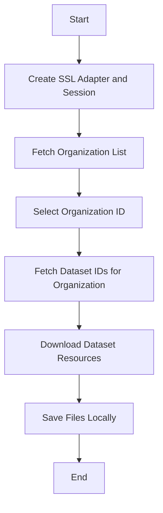

# open-ksa

## Overview

`open-ksa` is a Python package designed to facilitate downloading and managing datasets from the Kingdom of Saudi Arabia's Open Data portal. It provides a set of utilities to fetch organization information, retrieve dataset resources, and download data files efficiently. This package is ideal for developers and data engineers looking to programmatically access and work with KSA open data.

## Installation

Install the package via pip:

```bash
pip install open-ksa
```

## Key Features

- Fetch organization details and metadata.
- Retrieve dataset IDs and resources for specific organizations.
- Download dataset resources with support for common file formats (CSV, XLSX, XLS).
- Manage SSL connections with a custom adapter for reliable HTTPS requests.
- Concurrent downloading with progress indication.

## Package Structure

- `organizations()`: Fetches organization information from the KSA Open Data API. Supports saving results to JSON or CSV.
- `get_org_resources(org_id)`: Retrieves organization name, ID, and dataset IDs for a given organization.
- `get_dataset_resource(dataset_id, ...)`: Downloads all resources for a single dataset matching allowed file extensions.
- `get_dataset_resources(dataset_ids, ...)`: Concurrently downloads resources for multiple datasets.
- `download_file(session, url, headers, file_path, resource_id, ...)`: Low-level utility to download a file with error handling.
- `SSLAdapter` and `SingletonSession`: Custom SSL adapter and singleton session for consistent HTTPS requests.

## Usage Examples

### 1. List Organizations

```python
from open_ksa import organizations

orgs = organizations()
for org in orgs['content'][:10]:
    print(org['name'])
```

### 2. Download Resources for a Single Dataset

```python
from open_ksa import get_dataset_resource

dataset_id = 'e63563d0-3312-48f3-8786-7c3e2af61fe7'
get_dataset_resource(dataset_id, verbose=True)
```

### 3. Download Resources for Multiple Datasets of an Organization

```python
from open_ksa import get_org_resources, get_dataset_resources

org_id = 'a9e617ff-d918-4f4d-8be1-c42b733b1143'  # King Saud University
resources = get_org_resources(org_id=org_id)
dataset_ids = resources['dataset_ids']

get_dataset_resources(dataset_ids=dataset_ids[:10],
                      output_dir=f"opendata/{resources['organization_name'].strip().replace(' ', '_').lower()}",
                      allowed_exts=['csv'],
                      verbose=False,
                      show_progress=True)
```

### 4. Full Workflow: Download All Datasets for an Organization

```python
import open_ksa as ok

def main():
    orgs = ok.organizations()
    ks = orgs['content'][3]['publisherID']  # Select organization by index
    resources = ok.get_org_resources(org_id=ks)
    dataset_ids = resources['dataset_ids']

    ok.get_dataset_resources(dataset_ids=dataset_ids,
                             output_dir=f"opendata/{resources['organization_name'].strip().replace(' ', '_').lower()}")

if __name__ == "__main__":
    main()
```

## Process Flow Diagram



## Running Tests

Tests are located in the `open_ksa/tests` directory. Run tests using:

```bash
pytest open_ksa/tests
```

## Examples

See the `examples/scripts` directory for practical usage scripts:

- `1_organizations.py`: List organizations.
- `2_get_dataset_resource.py`: Download resources for a single dataset.
- `3_get_dataset_resources.py`: Download resources for multiple datasets.
- `4_org_and_resources.py`: Full workflow to download all datasets for an organization.

## Contribution

Please follow the contribution guidelines:

1. Fork the repository and create a new branch.
2. Make your changes following the coding style.
3. Submit a pull request with a detailed description.
4. Discuss changes via issues or email before implementation.
5. Follow the [Code of Conduct](CODE_OF_CONDUCT.md).

## License

This project is licensed under the terms of the MIT License. See the [LICENSE](LICENSE) file for details.