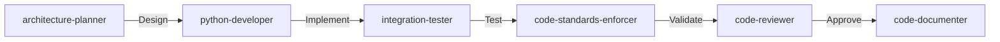
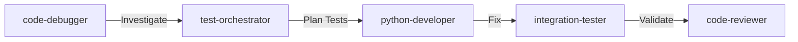
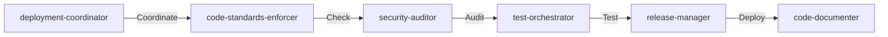

# ProjectX SDK Agent Configuration

This directory contains specialized agent configurations for the project-x-py async trading SDK development.

## Agent Directory

### Implementation Agents (Write Code)
These agents have full tool access and directly implement features:

| Agent | Purpose | Key Tools | When to Use |
|-------|---------|-----------|-------------|
| **python-developer** | Core SDK development | Read, Write, Edit, Bash, WebSearch | Writing new features, fixing bugs, implementing components |
| **code-refactor** | Architecture improvements | Read, Write, Edit, Grep, Bash | Refactoring code, optimizing patterns, modernizing architecture |
| **code-documenter** | Documentation creation | Read, Write, Edit, WebFetch | Writing docs, examples, migration guides, API references |
| **integration-tester** | Test implementation | Read, Write, Edit, Bash | Creating tests, mock data, test fixtures |
| **release-manager** | Release execution | Read, Write, Edit, Bash | Version bumping, changelog, PyPI deployment |

### Analysis & Review Agents (Read-Only)
These agents analyze and review but don't write code:

| Agent | Purpose | Key Tools | When to Use |
|-------|---------|-----------|-------------|
| **code-reviewer** | Code review | Read, Grep, Bash, WebFetch | PR reviews, quality checks, before releases |
| **code-standards-enforcer** | Standards compliance | Read, Grep, Bash, WebSearch | Checking async compliance, type safety, standards |
| **performance-optimizer** | Performance analysis | Read, Grep, Bash, WebSearch | Profiling, benchmarking, optimization planning |
| **security-auditor** | Security review | Read, Grep, Bash, WebFetch | Vulnerability scanning, security compliance |
| **code-debugger** | Issue investigation | Read, Grep, Bash, WebFetch | Debugging issues, root cause analysis |
| **data-analyst** | Data validation | Read, Grep, Bash, NotebookEdit | Indicator validation, market analysis, metrics |

### Coordinator Agents (Orchestration Only)
These agents coordinate other agents but don't directly implement:

| Agent | Purpose | Key Tools | When to Use |
|-------|---------|-----------|-------------|
| **architecture-planner** | System design | Read, Grep, TodoWrite, WebSearch | Complex features, multi-agent coordination |
| **test-orchestrator** | Test coordination | Read, Grep, Bash, TodoWrite | Test planning, coverage strategy, TDD workflow |
| **deployment-coordinator** | Deployment orchestration | Read, Grep, TodoWrite, WebSearch | Release coordination, deployment workflows |

## Tool Access Matrix

### Full Implementation Access
```
Read, Write, Edit, MultiEdit, NotebookEdit, Glob, Grep,
Bash, BashOutput, KillBash, TodoWrite, WebFetch, WebSearch
```
**Agents:** python-developer

### Limited Implementation Access
```
Read, Write, Edit, MultiEdit, Glob, Grep, Bash, TodoWrite, WebSearch
```
**Agents:** code-refactor, code-documenter

### Execution & Testing Access
```
Read, Write, Edit, Glob, Grep, Bash, BashOutput, KillBash, TodoWrite
```
**Agents:** integration-tester

### Release Management Access
```
Read, Write, Edit, Glob, Grep, Bash, TodoWrite, WebFetch
```
**Agents:** release-manager

### Analysis & Review Access
```
Read, Glob, Grep, Bash, BashOutput, [KillBash], TodoWrite, WebSearch/WebFetch
```
**Agents:** code-reviewer, code-standards-enforcer, performance-optimizer, security-auditor, code-debugger

### Data Analysis Access
```
Read, Glob, Grep, Bash, BashOutput, NotebookEdit, TodoWrite, WebSearch
```
**Agents:** data-analyst

### Coordination Access (Minimal)
```
Read, Glob, Grep, TodoWrite, WebSearch, [Bash]
```
**Agents:** architecture-planner, test-orchestrator, deployment-coordinator

## Agent Collaboration Patterns

### Feature Development Flow


### Bug Fix Flow


### Release Flow


## Usage Guidelines

### When to Use Coordinator Agents

**Use coordinator agents when:**
- Task requires multiple specialized agents
- Complex feature needing design and planning
- Orchestrating deployment or testing workflows
- Breaking down vague requirements
- Coordinating parallel agent activities

**Skip coordinator agents when:**
- Simple, straightforward tasks
- Single-agent responsibilities
- Quick bug fixes
- Documentation updates
- Routine maintenance

### Agent Selection Best Practices

1. **Start with the right agent**: Choose based on primary task type
2. **Use coordinators for complexity**: Let them orchestrate multi-agent workflows
3. **Leverage specialization**: Each agent excels in their domain
4. **Parallel execution**: Run independent agents concurrently
5. **Follow patterns**: Use established collaboration workflows

## Tool Usage Philosophy

### Write Access Principles
- **python-developer**: Full access for feature implementation
- **code-refactor**: Write access for architecture improvements
- **code-documenter**: Write access for documentation
- **integration-tester**: Write access for test creation
- **release-manager**: Write access for release artifacts

### Read-Only Principles
- **Reviewers/Auditors**: Analyze without modifying
- **Standards Enforcers**: Check compliance without fixing
- **Performance Analyzers**: Profile without optimizing
- **Debuggers**: Investigate without patching

### Coordination Principles
- **Minimal tools**: Only what's needed for orchestration
- **No implementation**: Delegate to specialized agents
- **TodoWrite essential**: Track complex workflows
- **WebSearch useful**: Research solutions and patterns

## Agent Communication

### Inter-Agent Communication Pattern
```python
# Coordinator delegates to implementer
architecture-planner -> python-developer:
  "Implement OrderManager.place_bracket_order() with specs..."

# Implementer reports to reviewer
python-developer -> code-reviewer:
  "Implementation complete, ready for review..."

# Reviewer coordinates with tester
code-reviewer -> integration-tester:
  "Approved, needs integration tests for..."
```

### Task Handoff Protocol
1. **Clear requirements**: Specify exactly what's needed
2. **Context provision**: Share relevant background
3. **Success criteria**: Define completion conditions
4. **Constraints**: Note any limitations or requirements
5. **Priority**: Indicate urgency if applicable

## Configuration Format

Each agent configuration file follows this format:

```yaml
---
name: agent-name
description: Agent purpose and specialization
tools: Comma-separated list of allowed tools
model: sonnet  # or other model
color: display color for UI
---

# Agent documentation in Markdown
```

## Adding New Agents

To add a new agent:

1. Create `agent-name.md` in this directory
2. Add YAML frontmatter with name, description, tools, model, color
3. Document agent's purpose, responsibilities, workflows
4. Define tool access based on agent role:
   - Implementation agents: Write access
   - Analysis agents: Read-only access
   - Coordinator agents: Minimal tools
5. Update this README with the new agent

## Quality Standards

All agents must:
- Have clear, focused responsibilities
- Use appropriate tool access for their role
- Follow established patterns
- Document their workflows
- Coordinate efficiently with other agents
- Maintain high quality standards

## Version History

- **v1.0.0**: Initial agent configuration
- **v1.1.0**: Added coordinator agents (architecture-planner, test-orchestrator, deployment-coordinator)
- **v1.2.0**: Refined tool access permissions for role-based separation
