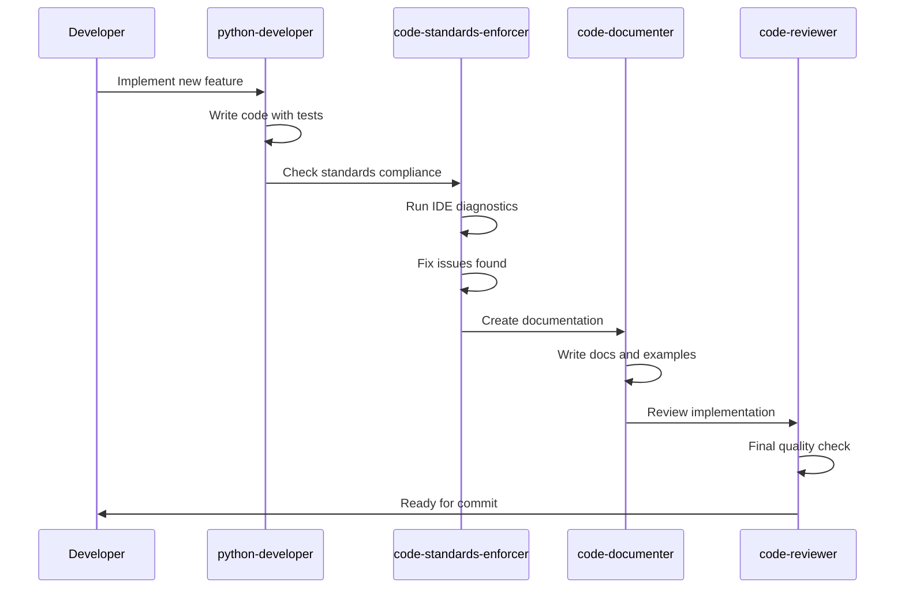

# AI Agents for Development

The ProjectX Python SDK leverages specialized AI agents for development tasks. This guide explains how to work with these agents effectively for SDK development, maintenance, and enhancement.

## Agent Overview

The project uses multiple specialized AI agents, each optimized for specific development tasks:

- **python-developer**: Core SDK development and feature implementation
- **code-standards-enforcer**: Code quality, standards compliance, and IDE diagnostics
- **code-refactor**: Architecture improvements and code modernization
- **code-documenter**: Documentation creation and maintenance
- **code-debugger**: Issue diagnosis and troubleshooting
- **code-reviewer**: Code review and quality assurance

## Agent Selection Guidelines

### When to Use Each Agent

#### **python-developer**
**Best for**: Core SDK development and feature implementation

Use when:
- Implementing new trading components (OrderManager, PositionManager, etc.)
- Creating financial indicators with Polars DataFrames
- Building real-time data processing and WebSocket connections
- Developing new TradingSuite features
- Ensuring 100% async architecture compliance
- Handling Decimal price precision requirements

Example scenarios:
```
"Implement a new technical indicator for options flow analysis"
"Add WebSocket reconnection logic with exponential backoff"
"Create async order placement methods with bracket order support"
"Build a new risk management component with portfolio-level controls"
```

#### **code-standards-enforcer**
**Best for**: Maintaining code quality and standards

**CRITICAL**: Always check IDE diagnostics first with `mcp__ide__getDiagnostics`

Use when:
- **Before committing any changes** (proactive quality control)
- Preparing for pull requests
- Release validation processes
- Verifying 100% async architecture compliance
- Checking TradingSuite patterns adherence
- Ensuring Polars-only DataFrame usage
- Validating deprecation compliance
- Type safety verification with TypedDict/Protocol

Workflow:
1. **First**: Check `mcp__ide__getDiagnostics` for modified files
2. **Fix** any IDE diagnostic errors/warnings
3. **Then**: Run traditional linting tools (ruff, mypy)
4. **Verify** with IDE diagnostics again after fixes

Example scenarios:
```
"Check code quality before committing new indicator implementation"
"Validate async patterns in the new order management system"
"Ensure type safety compliance across all modified files"
"Verify deprecation warnings are properly implemented"
```

#### **code-refactor**
**Best for**: Architecture improvements and modernization

Use when:
- Migrating to TradingSuite patterns
- Optimizing Polars DataFrame operations
- Consolidating WebSocket handling
- Modernizing async patterns and removing legacy sync code
- Transitioning from monolithic to modular architectures
- Optimizing event system performance
- Implementing memory management improvements

Example scenarios:
```
"Refactor OrderManager to use EventBus for better decoupling"
"Optimize DataFrame operations in indicators for better performance"
"Migrate legacy synchronous code to modern async patterns"
"Consolidate WebSocket connections for improved resource usage"
```

#### **code-documenter**
**Best for**: Documentation creation and maintenance

Use when:
- Documenting new TradingSuite APIs and features
- Writing indicator function documentation with usage examples
- Explaining WebSocket events and data flow patterns
- Creating migration guides for breaking changes
- Maintaining README files and examples directory
- Writing deprecation notices with clear upgrade paths
- Updating docstrings with comprehensive type hints
- Creating tutorial notebooks and interactive examples

Example scenarios:
```
"Document the new risk management system with usage examples"
"Create migration guide for v3 to v4 breaking changes"
"Update API documentation for the enhanced order management system"
"Write comprehensive examples for the new indicator framework"
```

#### **code-debugger**
**Best for**: Issue diagnosis and troubleshooting

Use when:
- Investigating WebSocket disconnection issues
- Diagnosing order lifecycle failures
- Troubleshooting real-time data gaps
- Resolving event system deadlocks
- Fixing price precision errors
- Identifying memory leaks and performance bottlenecks
- Debugging AsyncIO-related issues
- Tracing SignalR connection problems

Example scenarios:
```
"Debug why orders aren't filling after placement"
"Investigate WebSocket reconnection failures under load"
"Trace event propagation issues in the real-time system"
"Diagnose memory leaks in long-running data streams"
```

#### **code-reviewer**
**Best for**: Code review and quality assurance

Use when:
- Reviewing async patterns and implementations
- Checking real-time performance characteristics
- Validating financial data integrity and precision
- Ensuring API stability and backward compatibility
- Conducting pre-release code reviews
- Reviewing pull requests for quality and standards

Example scenarios:
```
"Review the new bracket order implementation for correctness"
"Check real-time data processing for performance issues"
"Validate the new indicator calculations for accuracy"
"Review API changes for backward compatibility"
```

## Agent Command Requirements

### Essential Commands for All Agents

**File Operations**:
- `Read`, `Write`, `Edit`, `MultiEdit` for file manipulation
- `Glob`, `Grep` for code searching and analysis
- `LS` for directory exploration

**Version Control**:
- `git status`, `git diff`, `git add` for change management
- `git log` for commit history analysis

**Testing**:
- `./test.sh [script]` - **Always use this for running tests and examples**
- Never use `uv run python` directly - `test.sh` handles environment variables

### Agent-Specific Commands

#### **python-developer**
```bash
# Development commands
uv add [package]              # Add new dependencies
uv run pytest tests/         # Run test suite
./test.sh examples/*.py       # Test example scripts
uv run mypy src/             # Type checking

# Example workflow
./test.sh examples/01_basic_client_connection.py
uv run pytest tests/test_new_feature.py -v
```

#### **code-standards-enforcer**
```bash
# CRITICAL: Always check IDE diagnostics first
mcp__ide__getDiagnostics     # Check IDE errors/warnings

# Traditional linting (after IDE check)
uv run ruff check .          # Lint code
uv run ruff format .         # Format code
uv run mypy src/             # Type checking
uv run pytest --cov         # Coverage analysis

# Example workflow
1. mcp__ide__getDiagnostics  # Always first
2. Fix any IDE issues
3. uv run ruff check . --fix
4. uv run mypy src/
5. mcp__ide__getDiagnostics  # Verify fixes
```

#### **code-debugger**
```bash
# Debugging commands
./test.sh --debug [script]   # Run with debug output
grep -r "error\|exception" src/  # Search for error patterns
uv run pytest -v -s --tb=long    # Verbose test output

# Performance profiling
uv run python -m cProfile script.py
```

## MCP Server Integration

### Essential MCP Servers for All Agents

**Core Development**:
- `mcp__smithery-ai-filesystem` - File operations and management
- `mcp__aakarsh-sasi-memory-bank-mcp` - Progress tracking and context
- `mcp__mcp-obsidian` - Development planning and documentation

### Agent-Specific MCP Servers

#### **python-developer**
- `mcp__project-x-py_Docs` - Search existing documentation and patterns
- `mcp__upstash-context-7-mcp` - Get library documentation for dependencies
- `mcp__waldzellai-clear-thought` - Complex problem solving and architecture
- `mcp__itseasy-21-mcp-knowledge-graph` - Map component relationships

Example usage:
```python
# Search for existing patterns
await mcp__project_x_py_Docs__search_project_x_py_code(
    query="async def place_bracket_order"
)

# Track implementation progress
await mcp__aakarsh_sasi_memory_bank_mcp__track_progress(
    action="Implemented async bracket order system",
    description="Added OCO support with automatic stop/target placement"
)
```

#### **code-standards-enforcer**
- `mcp__ide__getDiagnostics` - **CRITICAL**: Check IDE diagnostics first
- `mcp__project-x-py_Docs` - Verify code against documentation standards

Example workflow:
```python
# ALWAYS start with IDE diagnostics
ide_issues = await mcp__ide__getDiagnostics()

# Fix issues found by IDE
if ide_issues:
    # Fix each issue systematically
    pass

# Then run traditional tools
# uv run ruff check . --fix
# uv run mypy src/
```

#### **code-refactor**
- `mcp__waldzellai-clear-thought` - Plan refactoring strategies
- `mcp__itseasy-21-mcp-knowledge-graph` - Understand component dependencies
- `mcp__aakarsh-sasi-memory-bank-mcp` - Log architectural decisions

#### **code-documenter**
- `mcp__mcp-obsidian` - Create comprehensive documentation
- `mcp__project-x-py_Docs` - Reference existing patterns
- `mcp__tavily-mcp` - Research external API documentation

#### **code-debugger**
- `mcp__waldzellai-clear-thought` - Systematic issue analysis
- `mcp__itseasy-21-mcp-knowledge-graph` - Trace data flow and dependencies
- `mcp__ide__getDiagnostics` - Get real-time error diagnostics

## Multi-Agent Workflows

### Feature Development Workflow



### Example Implementation

When implementing a new feature, use agents in sequence:

1. **python-developer**: Core implementation
```
"Implement a new volatility-adjusted position sizing algorithm that:
- Uses ATR for volatility measurement
- Integrates with the existing RiskManager
- Supports both fixed and percentage-based risk models
- Includes comprehensive async tests"
```

2. **code-standards-enforcer**: Quality validation
```
"Review the new position sizing implementation for:
- Check IDE diagnostics for any errors
- Async pattern compliance
- Type safety with proper protocols
- Code formatting and style
- Test coverage requirements"
```

3. **code-documenter**: Documentation creation
```
"Document the new volatility-adjusted position sizing feature:
- API reference with comprehensive docstrings
- Usage examples with MNQ futures
- Integration guide for existing strategies
- Migration notes if any breaking changes"
```

4. **code-reviewer**: Final validation
```
"Perform final review of the position sizing feature:
- Code quality and maintainability
- Performance implications
- API design consistency
- Test coverage and quality"
```

## Best Practices for Agent Usage

### Agent Selection

1. **Be Specific**: Choose the most appropriate agent for the task
2. **Use Proactively**: Don't wait for explicit requests - choose the right agent
3. **Combine When Needed**: Use multiple agents for complex tasks
4. **Parallel Execution**: Run independent tasks concurrently when possible

### Communication with Agents

1. **Provide Context**: Include relevant project information
2. **Be Specific**: Clear, detailed requirements
3. **Reference Standards**: Mention SDK-specific patterns and requirements
4. **Include Examples**: Show desired patterns or outcomes

### Quality Assurance

1. **IDE Diagnostics First**: Always check `mcp__ide__getDiagnostics` before traditional tools
2. **Test Everything**: Use `./test.sh` for all testing
3. **Validate Changes**: Ensure changes don't break existing functionality
4. **Document Impact**: Track architectural decisions and changes

## Agent Coordination Patterns

### Sequential Pattern
```
python-developer  code-standards-enforcer  code-documenter  code-reviewer
```
Use for: New feature development

### Parallel Pattern
```
python-developer + code-refactor (simultaneously)

code-standards-enforcer

code-documenter + code-reviewer (simultaneously)
```
Use for: Large refactoring projects

### Iterative Pattern
```
python-developer  code-debugger  code-standards-enforcer

code-documenter  code-reviewer
```
Use for: Complex bug fixes or performance optimizations

## Common Agent Workflows

### New Feature Development
1. **python-developer**: Implement core functionality
2. **code-standards-enforcer**: Validate standards and run diagnostics
3. **code-documenter**: Create documentation and examples
4. **code-reviewer**: Final quality review

### Bug Investigation
1. **code-debugger**: Diagnose and isolate issue
2. **python-developer**: Implement fix
3. **code-standards-enforcer**: Validate fix quality
4. **code-reviewer**: Ensure fix doesn't introduce regressions

### Architecture Improvement
1. **code-refactor**: Plan and execute refactoring
2. **code-standards-enforcer**: Ensure compliance with standards
3. **code-documenter**: Update affected documentation
4. **code-reviewer**: Validate architectural improvements

## Integration with Development Tools

### IDE Integration
- Agents work with VS Code diagnostics via `mcp__ide__getDiagnostics`
- Real-time error detection and fixing
- Type checking integration with mypy

### CI/CD Integration
- Agents can be used in GitHub Actions workflows
- Automated code quality checks
- Documentation generation and validation

### Project Management
- Progress tracking via Memory Bank MCP
- Architectural decision logging in Obsidian
- Knowledge graph maintenance for component relationships

By leveraging these AI agents effectively, you can maintain high code quality, comprehensive documentation, and robust architecture while developing the ProjectX Python SDK efficiently.
