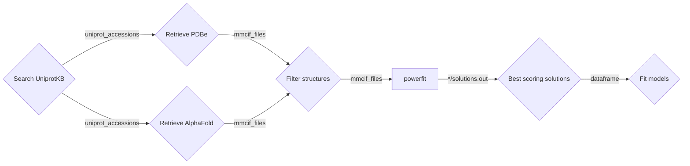

# protein-detective

[](https://www.bonvinlab.org/protein-detective/)
[](https://github.com/haddocking/protein-detective/actions/workflows/ci.yml)
[](https://www.research-software.nl/software/protein-detective)
[](https://pypi.org/project/protein-detective/)
[](https://doi.org/10.5281/zenodo.15632658)

Python package to detect proteins in EM density maps.

It uses

- [Uniprot Sparql endpoint](https://sparql.uniprot.org/) to search for proteins and their measured or predicted 3D structures.
- [powerfit](https://pypi.org/project/powerfit-em/) to fit protein structure in a Electron Microscopy (EM) density map.

An example workflow:



## Install

```shell
pip install protein-detective
```

Or to use the latest development version:
```
pip install git+https://github.com/haddocking/protein-detective.git
```

## Usage

The main entry point is the `protein-detective` command line tool which has multiple subcommands to perform actions.


To use programmaticly, see the [notebooks](docs/notebooks) and [API documentation](https://www.bonvinlab.org/protein-detective/autoapi/summary/).

### Search Uniprot for structures

```shell
protein-detective search \
    --taxon-id 9606 \
    --reviewed \
    --subcellular-location-uniprot nucleus \
    --subcellular-location-go GO:0005634 \
    --molecular-function-go GO:0003677 \
    --limit 100 \
    ./mysession
```
([GO:0005634](https://www.ebi.ac.uk/QuickGO/term/GO:0005634) is "Nucleus" and [GO:0003677](https://www.ebi.ac.uk/QuickGO/term/GO:0003677) is  "DNA binding")

In `./mysession` directory, you will find session.db file, which is a [DuckDB](https://duckdb.org/) database with search results.

### To retrieve a bunch of structures

```shell
protein-detective retrieve ./mysession
```

In `./mysession` directory, you will find mmCIF files from PDBe and PDB files and AlphaFold DB.

### To filter structure

Filter structures based on
                         
- For PDBe structures the chain of Uniprot protein is written as chain A.
- For AlphaFold structures filter by confidence (pLDDT) threshold
- Number of residues in chain A
  - For AlphaFold structures writes new files with low confidence residues (below threshold) removed
- Number of residues in secondary structure (helices and sheets)

Also uncompresses *.cif.gz files to *.cif files for compatibility with powerfit.

```shell
protein-detective --log-level INFO filter \
    --confidence-threshold 50 \
    --min-residues 100 \
    --max-residues 1000 \
    ./mysession

# or to filter only on secondary structure having some helices
protein-detective filter mysession --abs-min-helix-residues 40
```

### Powerfit

Rotate and translate the prepared structures to fit and score them into the EM density map using powerfit.

```shell
protein-detective powerfit run ../powerfit-tutorial/ribosome-KsgA.map 13 ./mysession
```

This will use [dask-distributed](https://distributed.dask.org/en/latest/) to run powerfit for each structure in parallel on multiple CPU cores or GPUs.

<details>

<summary>Run powerfits on Slurm</summary>

You can use [dask-jobqueue](https://jobqueue.dask.org/en/latest/) to run the powerfits
on a Slurm deployment on multiple machines on a shared filesystem.

In one terminal start the Dask cluster with

```shell
pip install dask-jobqueue
python3
```

```python
from dask_jobqueue import SLURMCluster

cluster = SLURMCluster(cores=8,
                       processes=4,
                       memory="16GB",
                       queue="normal")
print(cluster.scheduler_address)
# Prints something like: 'tcp://192.168.1.1:34059'
# Keep this Python process running until powerfits are done
```

In second terminal, run the powerfits on Dask cluster with

```shell
protein-detective powerfit run ../powerfit-tutorial/ribosome-KsgA.map 13 docs/session1 --scheduler-address tcp://192.168.1.1:34059
```

</details>

<details>
<summary>How to run efficiently</summary>

Powerfit is quickest on GPU, but can also run on CPU.

To run powerfits on a GPU you can use the `--gpu <workers_per_gpu>`.
The value of `workers_per_gpu` should be high enough so the GPU is fully utilized.
You can start with 1 (the default) and monitor the GPU usage with `nvtop` if you see that the GPU is not 100% loaded, you can increase the number until there are no more valleys in the GPU usage graph.

If you have multiple GPUs, then `--gpu 2` will run powerfits on all GPUs and run 2 powerfits concurrently on each GPU.

If you do not use `--gpu` flag, then powerfit will run on CPU.
By default each powerfit will use 1 CPU core and run multiple powerfits in parallel
according to the number of physical CPU cores available on the machine (so excluding hyperthreaded cores).

You can set the `--nproc <int>` so each powerfit will use that many CPU cores.
This is useful if you have more CPU cores available then there are structures to fit.
If the number of structure to fit is greater than available CPU cores then using the default (1 core per powerfit) is recommended.

</details>

<details>

<summary>Alternativly run powerfit yourself</summary>

You can use the `protein-detective powerfit commands` to print the commands.

The commands can then be run in whatever way you prefer, like sequentially, with [GNU parallel](https://www.gnu.org/software/parallel/),
or as a [Slurm array job](https://slurm.schedmd.com/job_array.html).

For example to run with parallel and 4 slots:

```shell
protein-detective powerfit commands ../powerfit-tutorial/ribosome-KsgA.map 13 docs/session1 > commands.txt
parallel --jobs 4 < commands.txt
```

</details>

To print top 10 solutions to the terminal, you can use:

```shell
protein-detective powerfit report docs/session1
```

Outputs something like:

```
powerfit_run_id,structure,rank,cc,fishz,relz,translation,rotation,pdb_id,pdb_file,uniprot_acc
10,A8MT69_pdb4e45.ent_B2A,1,0.432,0.463,10.091,227.18:242.53:211.83,0.0:1.0:1.0:0.0:0.0:1.0:1.0:0.0:0.0,4E45,docs/session1/single_chain/A8MT69_pdb4e45.ent_B2A.pdb,A8MT69
10,A8MT69_pdb4ne5.ent_B2A,1,0.423,0.452,10.053,227.18:242.53:214.9,0.0:-0.0:-0.0:-0.604:0.797:0.0:0.797:0.604:0.0,4NE5,docs/session1/single_chain/A8MT69_pdb4ne5.ent_B2A.pdb,A8MT69
...
```

To generate model PDB files rotated/translated to PowerFit solutions, you can use:

```shell
protein-detective powerfit fit-models docs/session1
```

## Contributing

For development information and contribution guidelines, please see [CONTRIBUTING.md](CONTRIBUTING.md).
