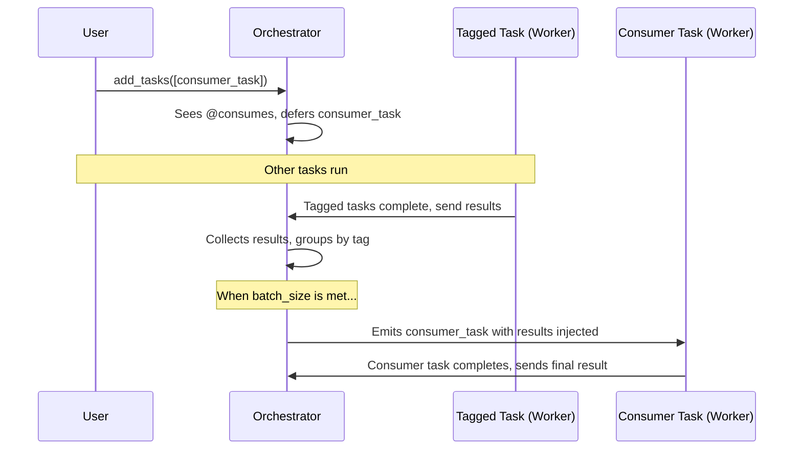

# Consumes Trait

Implements a non-blocking, orchestrator-managed "fan-in" pattern where one task waits for and collects the results from many other tasks. This is useful for aggregation or finalization steps after a "fan-out" process created by a `Produces` task.

Producers and consumers are linked via shared string `tags`.

### How it Works

The entire process is managed by the Orchestrator to prevent workers from blocking while waiting for results.

1.  **Task Submission**: A user submits a consumer task (e.g., `@consumes(tags=["batch_A"], batch_size=10)`).
2.  **Consumer Deferral**: When the Orchestrator receives the consumer task, it recognizes the `ConsumesTrait` and places the task into an internal "waiting" collection, keyed by its primary tag (`"batch_A"`). The consumer task is **not** sent to a worker.
3.  **Result Tracking**: As other tasks tagged with `"batch_A"` complete, the Orchestrator collects their results.
4.  **Consumer Emission**: Once the Orchestrator has collected enough results to satisfy a waiting consumer's `batch_size` (e.g., 10 results), it "emits" the consumer task.
5.  **Injection and Execution**: The Orchestrator creates a new instance of the consumer task, injects the collected results as a list into the `consumed_results` keyword argument, and submits it to a worker for execution. The worker receives a task that is ready to run immediately without blocking.

