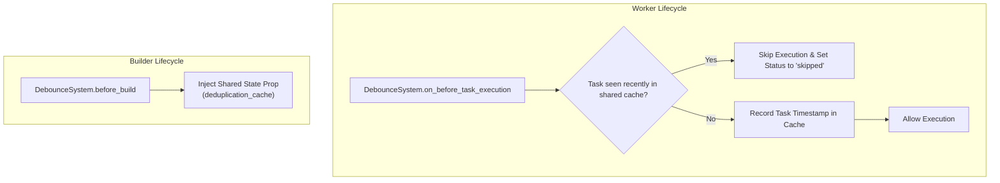

# Debounce Trait

Prevents duplicate tasks from executing within a specified time window. Uniqueness is determined by the task's action, arguments, and an optional `group`.

```mermaid
graph TD
    subgraph Worker Lifecycle
        A[DebounceSystem.on_before_task_execution] --> B{Task seen recently in shared cache?};
        B -->|Yes| C[Skip Execution & Set Status to 'skipped'];
        B -->|No| D[Record Task Timestamp in Cache];
        D --> E[Allow Execution];
    end

    subgraph Builder Lifecycle
        F[DebounceSystem.before_build] --> G["Inject Shared State Prop<br/>(deduplication_cache)"];
    end
```
