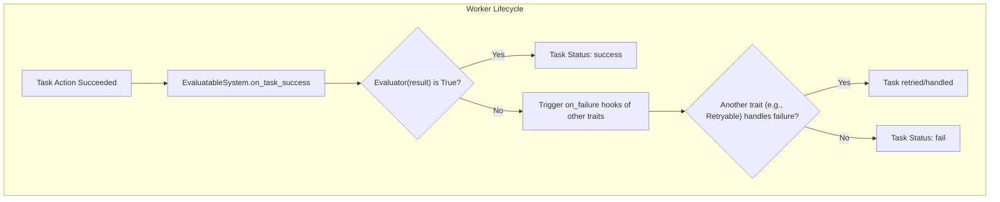

# Evaluatable Trait

Validates the result of a successful task using a custom evaluator function. If the evaluation fails, it triggers the `on_failure` lifecycle hook.

```mermaid
graph TD
    subgraph Worker Lifecycle
        A[Task Action Succeeded] --> B[EvaluatableSystem.on_task_success];
        B --> C{"Evaluator(result) is True?"};
        C -->|Yes| D[Task Status: success];
        C -->|No| E[Trigger on_failure hooks of other traits];
        E --> F{"Another trait (e.g., Retryable) handles failure?"};
        F -->|Yes| G[Task retried/handled];
        F -->|No| H[Task Status: fail];
    end
```
