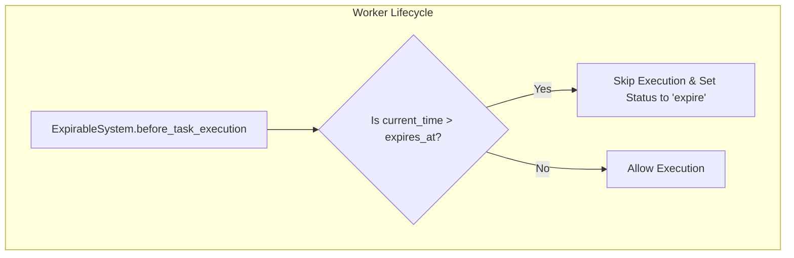

# Expirable Trait

Assigns an expiration timestamp to a task. If the task has expired before it starts executing, it is skipped.

```mermaid
graph TD
    subgraph Worker Lifecycle
        A[ExpirableSystem.before_task_execution] --> B{"Is current_time > expires_at?"};
        B -->|Yes| C[Skip Execution & Set Status to 'expire'];
        B -->|No| D[Allow Execution];
    end
```
