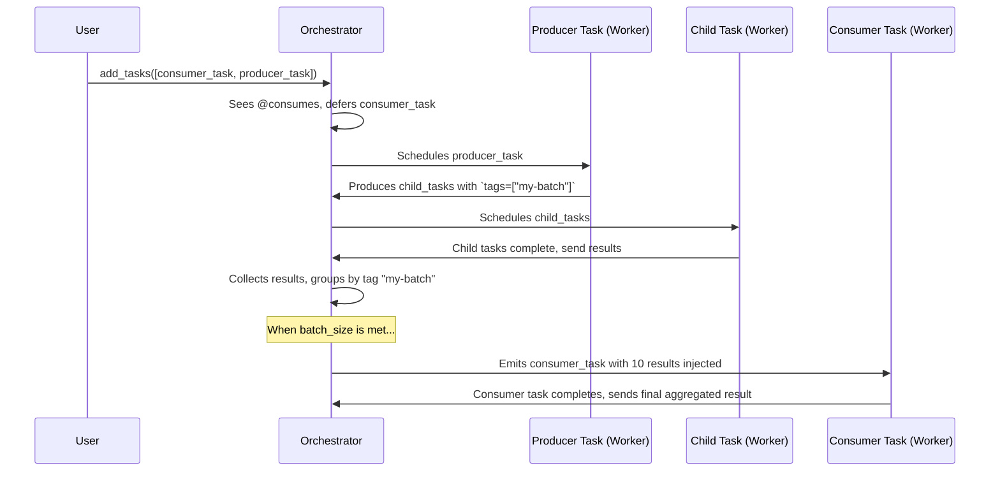

# Producer-Consumer Pattern with Tags

The `@produces` and `@consumes` traits work together to implement a powerful, non-blocking fan-out/fan-in pattern. Producers generate new tasks, and consumers aggregate their results. They are linked by a simple string identifier called a `tag`.

This allows for complex workflows where, for example, one task fans out to generate many parallel child tasks, and a final consumer task waits to collect all their results before completing the job. The entire process is managed by the Orchestrator to prevent workers from blocking.

### How it Works

1.  **Task Definition**:
    -   A **producer** task is decorated with `@produces(tags=["my-batch"])`. When it returns a `Task` or `list[Task]`, the system automatically adds `TaggedTrait(tags=["my-batch"])` to the new child tasks.
    -   A **consumer** task is decorated with `@consumes(tags=["my-batch"], batch_size=10)`. This tells the orchestrator that this task needs 10 results from tasks tagged `my-batch` before it can run.

2.  **Orchestrator Management**:
    -   When the consumer task is submitted, the orchestrator sees the `@consumes` trait and holds the task in a "waiting" state instead of sending it to a worker.
    -   The producer task runs and generates tagged child tasks.
    -   The orchestrator runs these child tasks. As they complete, it collects their results and groups them by tag.
    -   When the orchestrator has collected 10 results for the `"my-batch"` tag, it finds the waiting consumer.
    -   It injects the 10 results into the consumer's `consumed_results` argument and schedules the consumer to run on a worker.

3.  **Execution**: The consumer task receives all its required inputs at once and can execute immediately without any blocking.

### End-to-End Workflow Diagram

