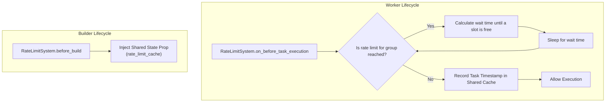

# RateLimit Trait

Limits the execution frequency of tasks based on a shared group identifier.

```mermaid
graph TD
    subgraph Worker Lifecycle
        A[RateLimitSystem.on_before_task_execution] --> B{Is rate limit for group reached?};
        B -->|Yes| C["Calculate wait time until a slot is free"];
        C --> D["Sleep for wait time"];
        D --> B;
        B -->|No| E[Record Task Timestamp in Shared Cache];
        E --> F[Allow Execution];
    end

    subgraph Builder Lifecycle
        G[RateLimitSystem.before_build] --> H["Inject Shared State Prop<br/>(rate_limit_cache)"];
    end
```
