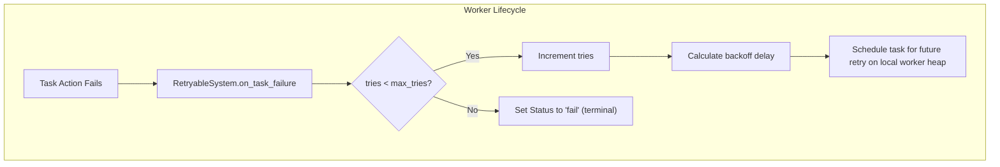

# Retryable Trait

Automatically retries a task if it fails, with a configurable number of attempts and backoff strategy.

```mermaid
graph TD
    subgraph Worker Lifecycle
        A[Task Action Fails] --> B[RetryableSystem.on_task_failure];
        B --> C{"tries < max_tries?"};
        C -->|Yes| D[Increment tries];
        D --> E[Calculate backoff delay];
        E --> F[Schedule task for future retry on local worker heap];
        C -->|No| G["Set Status to 'fail' (terminal)"];
    end
```
