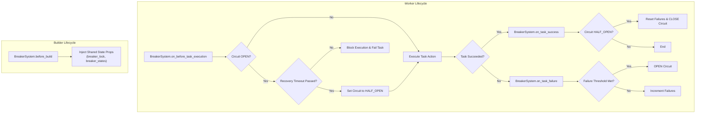

# Breaker Trait

Implements the Circuit Breaker pattern to prevent repeated failures against a shared resource. It transitions between CLOSED, OPEN, and HALF_OPEN states based on task success and failure.

