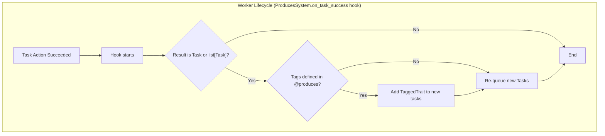

# Produces Trait

Allows a task to dynamically generate and schedule new tasks. It can also "tag" these new tasks so their results can be collected by a `Consumes` task.

### How it Works

When a task decorated with `@produces` completes successfully, its `on_success` hook is triggered in the worker. This hook inspects the task's result.

1.  **Produce New Tasks**: If the task's result is a `Task` or a `list[Task]`, these new tasks are automatically sent to the Orchestrator to be scheduled for execution.

2.  **Tagging for Consumers**: If the decorator was given a `tags` argument (e.g., `@produces(tags=["batch_A"])`), a `TaggedTrait` is automatically added to all the generated child tasks. This allows a `Consumes` task to identify and aggregate the results from this specific batch.

The diagram below illustrates the logic within the `on_success` hook.

