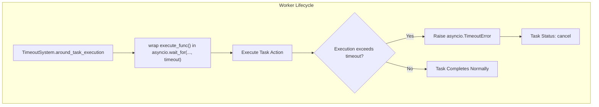

# Timeout Trait

Enforces a maximum execution time for a task. If the task exceeds the time limit, it is cancelled.

```mermaid
graph TD
    subgraph Worker Lifecycle
        A[TimeoutSystem.around_task_execution] --> B["wrap execute_func() in asyncio.wait_for(..., timeout)"];
        B --> C[Execute Task Action];
        C --> D{"Execution exceeds timeout?"};
        D -->|Yes| E[Raise asyncio.TimeoutError];
        E --> F[Task Status: cancel];
        D -->|No| G[Task Completes Normally];
    end
```
