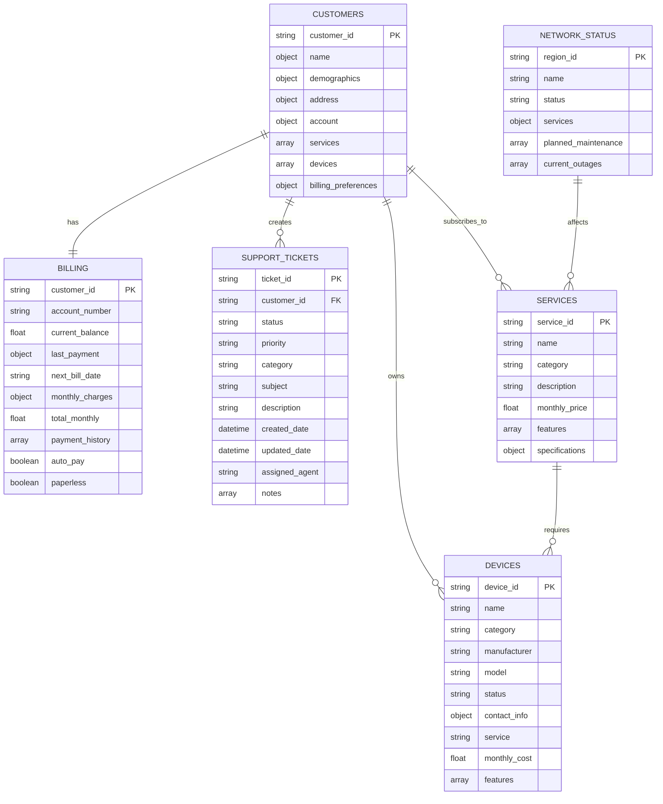
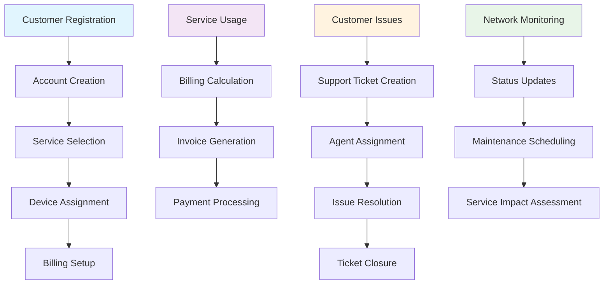

# Telecom Data Schema Documentation

This document provides a comprehensive overview of the telecom system data schema, including entity relationships, data structures, and visual diagrams.

## Overview

The telecom system manages customer data, services, billing, devices, support tickets, and network status across multiple entities with interconnected relationships.

## Entity Relationship Diagram



## Data Schema Details

### 1. Customers (`customers.json`)

**Primary Key:** `customer_id`

**Structure:**
```json
{
  "customer_id": {
    "customer_id": "string",
    "name": {
      "first_name": "string",
      "last_name": "string"
    },
    "demographics": {
      "date_of_birth": "date",
      "phone": "string",
      "email": "string"
    },
    "address": {
      "address1": "string",
      "address2": "string",
      "city": "string",
      "state": "string",
      "zip": "string",
      "country": "string"
    },
    "account": {
      "account_number": "string",
      "account_type": "residential|business",
      "status": "active|suspended",
      "created_date": "date",
      "credit_score": "integer",
      "payment_method": "string"
    },
    "services": ["array of service_ids"],
    "devices": ["array of device_ids"],
    "billing_preferences": {
      "paperless": "boolean",
      "auto_pay": "boolean",
      "billing_cycle": "string"
    }
  }
}
```

**Key Fields:**
- **Account Types:** `residential`, `business`
- **Account Status:** `active`, `suspended`
- **Payment Methods:** `auto_pay_credit_card`, `bank_transfer`, `invoice`, `credit_card`, `auto_pay_bank`

### 2. Services (`services.json`)

**Primary Key:** `service_id`

**Categories:**
- **Mobile:** `mobile`
- **Internet:** `internet`
- **TV:** `tv`
- **Phone:** `phone`
- **Security:** `security`

**Structure:**
```json
{
  "service_id": {
    "service_id": "string",
    "name": "string",
    "category": "mobile|internet|tv|phone|security",
    "description": "string",
    "monthly_price": "float",
    "features": ["array of strings"],
    "specifications": "object (varies by category)"
  }
}
```

**Service Categories & Examples:**

#### Mobile Services
- `mobile_unlimited` - Unlimited Mobile Plan ($85.00)
- `mobile_family_4lines` - Family Plan - 4 Lines ($160.00)
- `mobile_business_10lines` - Business Mobile - 10 Lines ($450.00)
- `mobile_basic` - Basic Mobile Plan ($35.00)
- `mobile_senior` - Senior Mobile Plan ($45.00)

#### Internet Services
- `internet_fiber_1gb` - Fiber Internet 1GB ($80.00)
- `internet_fiber_2gb` - Fiber Internet 2GB ($120.00)
- `internet_fiber_500mb` - Fiber Internet 500MB ($60.00)
- `internet_cable_500mb` - Cable Internet 500MB ($55.00)
- `internet_cable_100mb` - Cable Internet 100MB ($35.00)

#### TV Services
- `tv_premium` - Premium TV Package ($95.00)
- `tv_basic` - Basic TV Package ($45.00)
- `tv_sports_package` - Sports TV Package ($75.00)

#### Other Services
- `business_phone_system` - Business Phone System ($150.00)
- `home_security` - Home Security System ($40.00)

### 3. Billing (`billing.json`)

**Primary Key:** `customer_id`

**Structure:**
```json
{
  "customer_id": {
    "customer_id": "string",
    "account_number": "string",
    "current_balance": "float",
    "last_payment": {
      "amount": "float",
      "date": "date",
      "method": "string",
      "status": "completed|pending|failed"
    },
    "next_bill_date": "date",
    "monthly_charges": {
      "service_name": "float",
      "taxes_fees": "float"
    },
    "total_monthly": "float",
    "payment_history": [
      {
        "date": "date",
        "amount": "float",
        "status": "completed|late|failed"
      }
    ],
    "auto_pay": "boolean",
    "paperless": "boolean"
  }
}
```

### 4. Devices (`devices.json`)

**Primary Key:** `device_id`

**Categories:**
- **Mobile Phones:** `mobile_phone`
- **Networking:** `networking`
- **TV:** `tv`
- **Phone:** `phone`
- **Security:** `security`

**Structure:**
```json
{
  "device_id": {
    "device_id": "string",
    "name": "string",
    "category": "mobile_phone|networking|tv|phone|security",
    "manufacturer": "string",
    "model": "string",
    "status": "active|suspended|inactive",
    "contact_info": "varies by device type",
    "service": "string (service_id)",
    "monthly_cost": "float",
    "installation_date": "date",
    "features": ["array of strings"]
  }
}
```

**Device Examples:**
- **Mobile Phones:** iPhone 15 Pro, Samsung Galaxy S23, Google Pixel 8
- **Networking:** WiFi 6 Router, Enterprise Router, Basic Router
- **TV:** Samsung Smart TV, Cable Box HD, Conference Room TV
- **Phone:** Conference Phone System
- **Security:** Home Security System

### 5. Support Tickets (`support_tickets.json`)

**Primary Key:** `ticket_id`

**Structure:**
```json
{
  "ticket_id": {
    "ticket_id": "string",
    "customer_id": "string",
    "status": "open|in_progress|escalated|closed",
    "priority": "low|medium|high|urgent",
    "category": "internet|billing|mobile|tv|account",
    "subject": "string",
    "description": "string",
    "created_date": "datetime",
    "updated_date": "datetime",
    "resolved_date": "datetime (optional)",
    "assigned_agent": "string",
    "escalated_to": "string (optional)",
    "resolution": "string (optional)",
    "customer_satisfaction": "integer 1-5 (optional)",
    "notes": [
      {
        "date": "datetime",
        "agent": "string",
        "note": "string"
      }
    ]
  }
}
```

**Status Values:**
- `open` - Newly created ticket
- `in_progress` - Being worked on
- `escalated` - Escalated to supervisor
- `closed` - Resolved and closed

**Priority Levels:**
- `low` - Non-urgent issues
- `medium` - Standard priority
- `high` - Important issues
- `urgent` - Critical issues requiring immediate attention

**Categories:**
- `internet` - Internet service issues
- `billing` - Billing and payment issues
- `mobile` - Mobile service issues
- `tv` - TV service issues
- `account` - Account management issues

### 6. Network Status (`network_status.json`)

**Primary Key:** `region_id`

**Structure:**
```json
{
  "network_regions": {
    "region_id": {
      "region_id": "string",
      "name": "string",
      "status": "operational|maintenance|degraded|outage",
      "services": {
        "mobile": {
          "status": "string",
          "coverage": "excellent|good|fair|poor",
          "speed_avg": "string",
          "last_outage": "datetime",
          "outage_duration": "string"
        },
        "internet": {
          "status": "string",
          "fiber_availability": "percentage",
          "cable_availability": "percentage",
          "avg_speed_fiber": "string",
          "avg_speed_cable": "string"
        },
        "tv": {
          "status": "string",
          "signal_quality": "excellent|good|fair|poor",
          "hd_channels": "available|unavailable",
          "streaming_quality": "string"
        }
      }
    }
  },
  "planned_maintenance": [
    {
      "region": "string",
      "service": "string",
      "start_time": "datetime",
      "end_time": "datetime",
      "description": "string",
      "impact": "string"
    }
  ],
  "current_outages": [
    {
      "region": "string",
      "service": "string",
      "start_time": "datetime",
      "estimated_resolution": "datetime",
      "description": "string",
      "impact": "string",
      "affected_areas": ["array of strings"]
    }
  ]
}
```

**Regions Covered:**
- Denver, Colorado (`denver_co`)
- Austin, Texas (`austin_tx`)
- Seattle, Washington (`seattle_wa`)
- San Francisco, California (`san_francisco_ca`)
- Phoenix, Arizona (`phoenix_az`)

## Data Flow Diagram



## Key Relationships

### Customer-Service Relationship
- **One-to-Many:** Each customer can have multiple services
- **Reference:** `customers.services[]` contains `service_id` values
- **Billing:** Services are itemized in `billing.monthly_charges`

### Customer-Device Relationship
- **One-to-Many:** Each customer can own multiple devices
- **Reference:** `customers.devices[]` contains `device_id` values
- **Service Link:** Devices are associated with specific services

### Customer-Billing Relationship
- **One-to-One:** Each customer has one billing record
- **Reference:** Both use the same `customer_id` as primary key
- **Synchronization:** Account numbers must match between entities

### Customer-Support Relationship
- **One-to-Many:** Each customer can create multiple support tickets
- **Reference:** `support_tickets.customer_id` links to `customers.customer_id`

### Regional Network Impact
- **Geographic:** Network status affects customers based on their address
- **Service Impact:** Network issues can affect specific service categories

## Data Validation Rules

### Customer Data
- `customer_id` must be unique across all customers
- `account_number` must match between customers and billing
- `email` should be unique per customer
- `services[]` must reference valid `service_id` values
- `devices[]` must reference valid `device_id` values

### Billing Data
- `customer_id` must exist in customers table
- `current_balance` can be negative (credit) or positive (owed)
- `total_monthly` should equal sum of all monthly charges
- Payment history dates should be in chronological order

### Device Data
- `device_id` must be unique across all devices
- `status` should align with customer account status
- Mobile devices must have valid `phone_number` and `imei`
- Networking devices must have valid `mac_address` and `ip_address`

### Support Tickets
- `customer_id` must exist in customers table
- `created_date` should be before `updated_date`
- `resolved_date` should only exist for closed tickets
- Notes should be in chronological order

### Network Status
- Region coverage should align with customer addresses
- Service availability percentages should be 0-100%
- Maintenance windows should not overlap for same region/service

## Common Data Patterns

### Status Fields
- **Customer Account:** `active`, `suspended`
- **Device:** `active`, `suspended`, `inactive`
- **Support Ticket:** `open`, `in_progress`, `escalated`, `closed`
- **Network:** `operational`, `maintenance`, `degraded`, `outage`

### Pricing Structure
- All prices are in USD (float format)
- Monthly charges are pre-tax
- Taxes and fees are calculated separately
- Discounts appear as negative values

### Date/Time Format
- **Dates:** ISO format `YYYY-MM-DD`
- **Timestamps:** ISO format with timezone `YYYY-MM-DDTHH:MM:SSZ`
- All times are in UTC

### Contact Information
- Phone numbers: `(XXX) XXX-XXXX` format
- Email addresses: Standard email validation
- Addresses: US format with state abbreviations

## Sample Queries

### Find Customer's Total Monthly Bill
```
customer = customers[customer_id]
billing = billing[customer_id]
total = billing.total_monthly
```

### Get Customer's Active Devices
```
customer = customers[customer_id]
active_devices = [devices[device_id] for device_id in customer.devices 
                  where devices[device_id].status == "active"]
```

### Find Open Tickets for Customer
```
customer_tickets = [ticket for ticket in support_tickets 
                   where ticket.customer_id == customer_id 
                   and ticket.status in ["open", "in_progress"]]
```

### Check Service Availability in Region
```
region_status = network_status.network_regions[region_id]
service_status = region_status.services[service_type].status
```

This schema provides a comprehensive foundation for managing telecom operations, customer relationships, billing, support, and network infrastructure.
