# USDM Biomedical Concept Mapper


> The first production-ready agent that maps biomedical concepts to the CDISC Unified Study Data Model using either commercial or open-source LLMs.

USDM Biomedical Concept Mapper is purpose-built for clinical teams who need accurate, explainable alignment between study artefacts and CDISC biomedical concepts. Our agentic workflow discovers, validates, and maps concepts end-to-end—without black-box pipelines or heavyweight infrastructure.

## Table of Contents

- [What does this project do?](#what-does-this-project-do)
- [Architecture Overview](#architecture-overview)
- [Robust Design Principles](#robust-design-principles)
- [Installation](#installation)
- [Quick Start](#quick-start)
- [Configuration](#configuration)
- [AI SDK Compatibility](#ai-sdk-compatibility)
- [Command Line Usage](#command-line-usage)
- [Advanced Usage](#advanced-usage)
- [Output Examples](#output-examples)
- [Development](#development)
- [Contributing](#contributing)
- [License](#license)
- [Support](#support)

## What does this project do?

The [USDM Biomedical Concept Mapper](https://github.com/AI-LENS/usdm-bc-mapper) helps identify biomedical concepts for activities in USDM files:

- **Automated Mapping**: Maps activities from USDM files to standardized biomedical concepts
- **AI-Powered Search**: Uses Large Language Models (LLMs) to find the best matching CDISC concepts for given activities
- **CDISC Integration**: Utilizes the latest [CDISC biomedical concepts](https://github.com/cdisc-org/COSMoS/blob/main/export/cdisc_biomedical_concepts_latest.csv) and [SDTM dataset specializations](https://github.com/cdisc-org/COSMoS/blob/main/export/cdisc_sdtm_dataset_specializations_latest.csv)
- **Batch Processing**: Processes entire USDM study files and generates mapped outputs

### Key Features

- **Multiple Search Methods**: Supports both LLM-powered exact matching and local index searching
- **Configurable AI Models**: Supports different commercial or open-source LLMs
- **Command Line Interface**: Easy-to-use CLI for batch processing and individual concept searches

## Architecture Overview

Our self-steering agent keeps the stack intentionally simple while delivering state-of-the-art accuracy. Every run goes through three explainable steps:

```mermaid
%%{init: {'theme':'neutral', 'flowchart': {'htmlLabels': true, 'curve': 'basis', 'wrap': true}}}%%
flowchart TB
    subgraph L1[Context & Retrieval]
        direction LR
        A["🧩 USDM Activity Context"] --> B["① Dynamic Retrieval<br/>🔍 bm25s + Polars index"] --> C{{"Top-K Concept Set"}}
    end

    subgraph L2[Reasoning & Delivery]
        direction LR
        D["② LLM Reasoning<br/>🤖 Commercial / open-source model"] --> E["③ USDM Mapping<br/>🛠️ SDK + deterministic writer"] --> F["📄 Downstream applications"]
    end

    C --> D

    classDef context fill:#E1F5FE,stroke:#0277BD,color:#01579B,font-weight:bold;
    classDef process fill:#E8F5E9,stroke:#2E7D32,color:#1B5E20;
    classDef decision fill:#FFF3E0,stroke:#EF6C00,color:#E65100,font-weight:bold;
    classDef output fill:#EDE7F6,stroke:#512DA8,color:#311B92,font-weight:bold;

    class A context
    class B,D,E process
    class C decision
    class F output
```



### Step 1 – Dynamic Retrieval
`CdiscBcIndex` builds a lightweight BM25 retriever over the latest CDISC biomedical concepts and SDTM specializations. For every prompt from the agent, it dynamically generates retrieval queries and returns a concise, templated synopsis of the top candidates.

### Step 2 – LLM Reasoning
`find_biomedical_concept` iteratively calls your chosen LLM (e.g. OpenAI, Gemini, or self-hosted open-weight models) to reason over the candidate set. The agent loop is implemented is transparent, providing explainable decision traces for each search.

### Step 3 – Deterministic USDM Mapping
`map_biomedical_concepts` enriches the USDM wrapper with the validated biomedical concept IDs, properties, and codelists. The mapper ensures every activity is linked to the correct CDISC structures and writes a ready-to-share JSON package.

**Why it works:** Retrieval keeps the LLM grounded, the reasoning step is model-agnostic, and the mapper uses CDISC-native schemas so teams get a fast, auditable pipeline without orchestrating multiple services.

## Robust Design Principles

- **Flexible LLM Integration**: Designed to work reliably with both enterprise APIs and local open-source models, providing teams with deployment flexibility and avoiding vendor lock-in.
- **Transparent Processing Pipeline**: Features a clear three-step workflow (retrieve, reason, map) with comprehensive audit trails and explainable decision logs for regulatory compliance.
- **Production-Ready Architecture**: Built on proven technologies including Polars for data processing, BM25 for retrieval, and the official USDM SDK—ensuring stability and maintainability.
- **Reliable Performance**: Engineered for consistent, traceable mappings that support regulatory workflows and CDISC metadata requirements.

## Installation

### Prerequisites

- Python 3.13 or higher
- Access to LLM (commercial or open-source)

### Install from PyPI

```bash
pip install usdm-bc-mapper
```

## Quick Start

1. **Install the package**:

   ```bash
   pip install usdm-bc-mapper
   ```

2. **Create a config file** (`config.yaml`) in your working directory:

   ```yaml
   llm_api_key: "your-api-key-here"
   llm_model: "gpt-5-mini"
   ```

3. **Run the mapper** on your USDM file:

   ```bash
   bcm usdm your_study.json
   ```

4. **Get help** with any command:
   ```bash
   bcm --help
   bcm usdm --help
   ```

## Configuration

Before using the tool, you need to configure your settings. Create a `config.yaml` file in your working directory (the same directory where your USDM JSON file is located):

```yaml
# config.yaml
llm_api_key: "your-api-key-here"
llm_model: "gpt-5-mini" # or your preferred model

# Optional Configurations
llm_base_url: "https://api.openai.com/v1" # or your custom endpoint
max_ai_lookup_attempts: 7 # max retries for AI lookup
data_path: "path/to/cdisc/data" # path to CDISC data files and system prompt for LLMs
data_search_cols: # columns to search in CDISC data
  - "short_name"
  - "bc_categories"
  - "synonyms"
  - "definition"
```

## AI SDK Compatibility

The mapper speaks the OpenAI-compatible API spec, so you can bring your own provider. See [docs/ai_sdk_compatibility.md](docs/ai_sdk_compatibility.md) for the full walkthrough; the quick-start presets are below.

**Commercial APIs**

```yaml
llm_base_url: "https://api.openai.com/v1"
llm_api_key: "sk-your-api-key"
llm_model: "gpt-5-mini"
```

**Open-weight Aggregators**

```yaml
llm_base_url: "https://openrouter.ai/api/v1"
llm_api_key: "sk-or-your-key"
llm_model: "meta-llama/llama-3.1-8b-instruct:free"
```

**Self-hosted Runtimes**

```yaml
llm_base_url: "http://localhost:11434/v1"
llm_api_key: "not-needed"
llm_model: "phi4"
```

> Need hardware tips and server commands? Jump to `docs/ai_sdk_compatibility.md`.

## Command Line Usage

The tool provides three main commands through the `bcm` CLI. Use `bcm --help` or `bcm <command> --help` to see detailed documentation for each command.

#### 1. Map USDM File Biomedical Concepts

Map all biomedical concepts in a USDM file to CDISC standards:

```bash
bcm usdm path/to/your/usdm_file.json --config config.yaml
```

With custom output file:

```bash
bcm usdm path/to/your/usdm_file.json --output mapped_results.json --config config.yaml
```

#### 2. Find Individual Biomedical Concept

Find CDISC match for a specific biomedical concept using LLM (provides exact matching):

```bash
bcm find-bc-cdisc "diabetes mellitus" --config config.yaml
```

#### 3. Search CDISC Biomedical Concepts

Search the local CDISC index for matching concepts (searches local index without LLM):

```bash
bcm search-bc-cdisc "blood pressure" --config config.yaml
```

Search with custom number of results:

```bash
bcm search-bc-cdisc "blood pressure" --k 20 --config config.yaml
```

**Note**: The main difference between `find-bc-cdisc` and `search-bc-cdisc` is that `find-bc-cdisc` uses an LLM to find exact matches, while `search-bc-cdisc` looks for matches in the local index.

## Advanced Usage

#### Enable Debug Logging

Add the `--show-logs` flag to any command to see detailed processing information:

```bash
bcm usdm path/to/file.json --config config.yaml --show-logs
```

## Output Examples

#### USDM Mapping Output

When using `bcm usdm`, the tool outputs the original USDM data with mapped CDISC biomedical concepts, including confidence scores and reasoning in structured JSON format.

#### Individual Concept Search Output

When using `bcm find-bc-cdisc` or `bcm search-bc-cdisc`, the tool returns matched CDISC concept details with relevance scores.

## Development

### Development Setup

Clone the project:

```bash
git clone https://github.com/AI-LENS/usdm-bc-mapper.git
```

Go to the project directory:

```bash
cd usdm-bc-mapper
```

Install dependencies:

```bash
uv sync --group dev
```

### Running Tests

```bash
pytest
```

### Pre-commit Hooks

Install pre-commit hooks for code quality:

```bash
pre-commit install
pre-commit run --all-files
```

## Contributing

Contributions are welcome! Please feel free to submit a Pull Request.

## License

This project is licensed under the MIT License.

## Support

For questions or issues, please open an issue on the GitHub repository.
