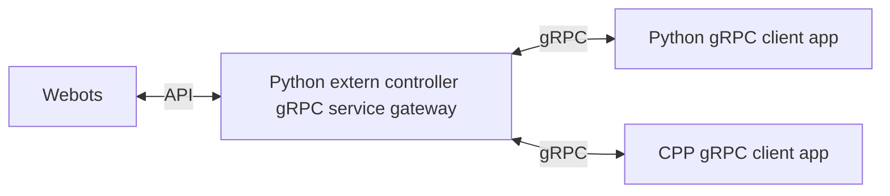

# webots-grpc

This project is a simple gateway convert from gRPC to webots socket IPC API. It follow some rules.

* [webots extern controller](https://cyberbotics.com/doc/guide/running-extern-robot-controllers)
* synchronous simulation



## run gateway (gRPC server)

for the most simple way

```bash
export WEBOTS_HOME=/usr/local/webots
uvx --from webots-grpc webots-grpc-gateway --robot-name="{ROBOT_NAME}"
```

## development

### gateway (gRPC server)

```bash
uv run python -m webots_grpc --robot-name="{ROBOT_NAME}"
uv run webots-grpc-gateway --robot-name="{ROBOT_NAME}"
# pipx run --spec . webots-grpc-gateway --robot-name="{ROBOT_NAME}"
# uvx --from git+https://github.com/existedinnettw/webots-grpc.git webots-grpc-gateway --robot-name="{ROBOT_NAME}"
```

`webots-grpc-gateway` is actually a wrapper for script, `webots_grpc/server.py`. `webots-grpc-gateway` will find webots controller automatically based on `WEBOTS_HOME` and execute the script automatically.

For development purpose, you can run the script though webots controller directly.

#### build

Create service from proto file,

```bash
uv run python -m grpc_tools.protoc -I ./protos --python_out=./webots_grpc/generated --pyi_out=./webots_grpc/generated --grpc_python_out=./webots_grpc/generated ./protos/*.proto
```

or generate document by [protoc-gen-doc](https://github.com/pseudomuto/protoc-gen-doc) plugin at the same time

```bash
uv run python -m grpc_tools.protoc -I ./protos --python_out=./webots_grpc/generated --pyi_out=./webots_grpc/generated --grpc_python_out=./webots_grpc/generated --doc_out=./doc --doc_opt=html,index.html ./protos/*.proto
```

Fix python import issue

```bash
uv run protol --create-package --in-place --python-out ./webots_grpc/generated protoc --protoc-path "uv run python -m grpc_tools.protoc" --proto-path=./protos ./protos/*.proto
```

##### compile executable

And if want to build exe file,

> [Configure additional module search paths, like PYTHONPATH #9168](https://github.com/astral-sh/uv/issues/9168)
> [option to specify a project root directory to be added to the python path](https://github.com/astral-sh/uv/issues/11175)

```bash
PYTHONPATH="${WEBOTS_HOME}/lib/controller/python" uv run python -m nuitka --include-module=controller --onefile --assume-yes-for-downloads ./webots_grpc/server.py --jobs=8
```

#### execution on linux

Modify your own robot name.

```bash
export WEBOTS_HOME=/usr/local/webots
uv run "${WEBOTS_HOME}/webots-controller" --robot-name='robot' ./webots_grpc/server.py
```

#### execution on windows

If you use MSYS2 [as state](https://cyberbotics.com/doc/guide/compiling-controllers-in-a-terminal#windows), `export WEBOTS_HOME=C:\Program Files\Webots`

> I don't find out way to integrate `WEBOTS_HOME` yet

Or using uv directly config python path,

```ini
; .env
PYTHONPATH=C:\Program Files\Webots\lib\controller\python
```

`uv run "C:\Program Files\Webots\msys64\mingw64\bin\webots-controller.exe" --robot-name='robot' .\webots_grpc\server.py`

### client

There are cpp and python client API support with unittests, plz refer python test `tests/README.md` for more information.

#### PYTHON

```bash
uv run python -m pytest
```

#### CPP

Check cpp client test `src/tests`

```bash
conan build . --build=missing
```
